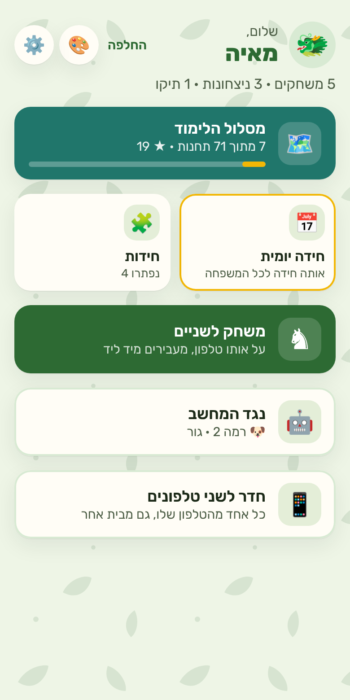
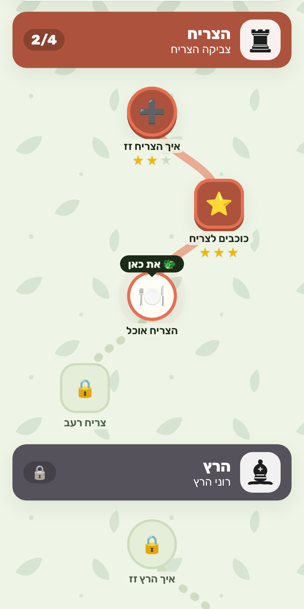
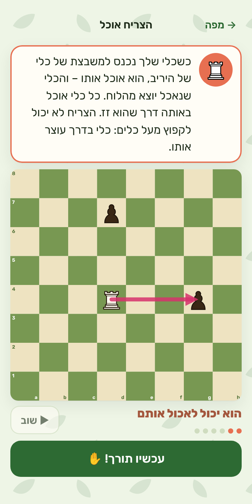
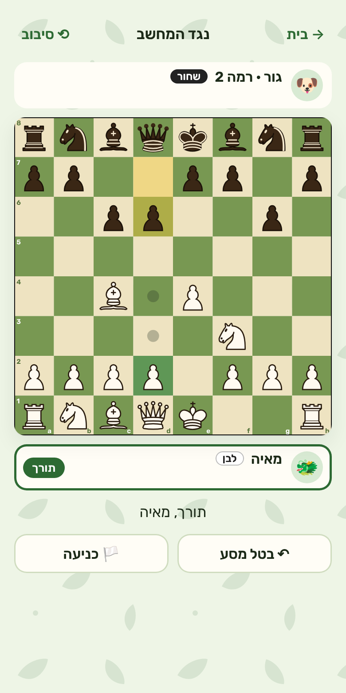
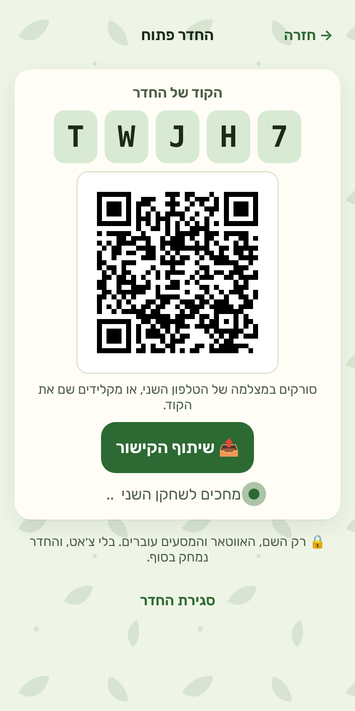

# ChessIt – לומדים שחמט ביחד

**https://chessit-6d389.web.app/**

אפליקציה לטלפון ללימוד שחמט, בעברית, לכל המשפחה. ילדים מגיל 5 ומבוגרים שלא יודעים איך הפרש זז מתחילים מאפס, וכל אחד מתקדם בקצב שלו: לומדים את הלוח והכלים, פותרים חידות, משחקים נגד המחשב, ומשחקים אחד נגד השני – על טלפון אחד או משני טלפונים.

בלי הרשמה, בלי פרסומות ובלי מעקב. כל הנתונים נשמרים רק בטלפון.

<p align="center">
  
  
  
  
  
</p>

## מה יש בפנים

- **מסלול לימוד** של 71 תחנות בשמונה חלקים: הלוח, הכלים (עולם קטן לכל כלי), אכילה והגנה, שח, מט, חוקים מיוחדים (הצרחה, הכתרה ועוד), טריקים (מזלג, סיכה), ועקרונות פתיחה ומשחק מודרך.
- **מותאם לגיל**: הסברים קצרים ומוקראים בקול לגיל 5–7, דוגמאות לגיל 8–12, ומבחן כניסה קצר למבוגרים שכבר מכירים קצת.
- **חידות** מהמאגר הפתוח של Lichess, חידה יומית לכל המשפחה, וחזרה על מה שהיה קשה.
- **נגד המחשב**: שמונה רמות, מ"אפרוח" שטועה בכוונה ועד "דרקון". אחרי משחק – סיכום פשוט: המסע הכי טוב, והמסע שכדאי ללמוד ממנו.
- **משחק לשניים** על אותו טלפון, עם מצב הורה-ילד (ההורה משחק בלי חלק מהכלים).
- **חדר לשני טלפונים**: אחד פותח חדר, השני סורק את ה-QR או מקליד קוד – גם מבית אחר.
- **פרופיל לכל אחד** עם דמות, ערכת נושא (נקי, חלל, יער קסום, בבהיר ובכהה) ו-PIN לא חובה.
- **עובד בלי אינטרנט** אחרי הפעם הראשונה (חוץ מהחדר), ו**גיבוי לקובץ** כדי להעביר את כל המשפחה לטלפון חדש.

## איך מתקינים בטלפון

זו אפליקציית רשת: לא צריך חנות אפליקציות. פותחים את הקישור ומוסיפים למסך הבית, ומאז היא נפתחת כמו כל אפליקציה, במסך מלא ובלי אינטרנט.

**אנדרואיד (Chrome)**

1. פותחים את https://chessit-6d389.web.app/ ב-Chrome.
2. לוחצים על שלוש הנקודות ⋮ למעלה.
3. בוחרים **"התקנת האפליקציה"** (או **"הוספה למסך הבית"**), ואז **"התקנה"**.

**אייפון ואייפד (Safari)**

1. פותחים את הקישור ב-**Safari** (לא בתוך וואטסאפ או אינסטגרם – שם לוחצים "פתיחה ב-Safari").
2. לוחצים על כפתור השיתוף (ריבוע עם חץ למעלה) בתחתית המסך.
3. גוללים ובוחרים **"הוספה למסך הבית"**, ואז **"הוסף"**.

**הקראה בעברית** (לגיל 5–7) צריכה קול עברי בטלפון. אם אין, האפליקציה מסבירה איך מוסיפים אותו – ובכל מקרה הכול עובד גם בלי.

## פרטיות

- הפרופילים, הכוכבים וההגדרות נשמרים **רק בטלפון**. אין חשבון ואין שרת שאוסף נתונים.
- בחדר לשני טלפונים עוברים רק השם, הדמות, המסעים וסמלי הרגש, דרך Firebase. החדר נמחק כששני השחקנים יוצאים.
- בלי פרסומות, בלי אנליטיקס ובלי עוגיות. גם הגופן נמצא באתר עצמו, כך שאין פנייה לשירותים אחרים.
- במסך **אודות ופרטיות** בתוך האפליקציה יש את הפירוט המלא, ושם גם "מחיקת כל הנתונים".

## מצאת בעיה?

באפליקציה: **הגדרות ← 🐞 מצאת בעיה?** – שם יש כפתור שמעתיק את פרטי הגרסה והמכשיר (בלי שמות). אפשר להדביק אותם בהודעה, יחד עם מה עשית ומה קרה.

---

## למפתחים

### מסמכים

- [ארכיטקטורה](docs/ARCHITECTURE.md)
- [מפת דרכים](docs/ROADMAP.md)
- [הקמת Firebase לחדרים](docs/FIREBASE.md)
- [בדיקות בטלפונים אמיתיים](docs/DEVICE-CHECKS.md)

### הרצה מקומית

דרוש Node.js 22 ומעלה.

```bash
npm install
npm run dev       # שרת פיתוח
npm run build     # בדיקת טיפוסים ובנייה לתיקיית dist
npm run preview   # הצגת הגרסה הבנויה
```

כדי לבדוק מהטלפון ברשת הביתית: `npm run dev -- --host`, ואז לפתוח בטלפון את הכתובת שמופיעה.

### פריסה

כל דחיפה לענף `main` בונה את האתר ומפרסמת אותו ב-Firebase Hosting, דרך `.github/workflows/deploy.yml`.

הגדרה חד-פעמית: הסוד `FIREBASE_SERVICE_ACCOUNT` במאגר, עם הרשאת Firebase Hosting Admin (ראו `docs/FIREBASE.md`, חלקים ד ו-ו).

חדרים (משחק בין שני טלפונים) עוברים דרך Firebase Realtime Database. ההקמה, כללי האבטחה והניקוי האוטומטי (`.github/workflows/cleanup-rooms.yml`) מתוארים ב-[docs/FIREBASE.md](docs/FIREBASE.md).

תמונת השיתוף (`public/og-image.png`) וצילומי המסך כאן נוצרים בסקריפטים: `bun scripts/og-image.ts && node scripts/og-image-shot.cjs`, ו-`node scripts/screenshots.cjs <כתובת של בנייה>` (שניהם צריכים Playwright).

## רישיון ותודות

ChessIt מופץ ב-GPL-3.0-or-later. ראו [LICENSE](LICENSE). הרישיון נבחר כדי לאפשר שימוש במנוע [Stockfish](https://stockfishchess.org) (‏GPL-3), שמשחק ברמות 3–8 ומסכם משחקים.

- חוקי השחמט: [chess.js](https://github.com/jhlywa/chess.js) (‏BSD-2-Clause). המסכים: [Preact](https://preactjs.com) (‏MIT).
- החידות לקוחות ממאגר החידות הפתוח של [Lichess](https://database.lichess.org/#puzzles) (‏CC0). כדי לבנות אותן מחדש מהמאגר המלא: `bun scripts/puzzles.ts lichess_db_puzzle.csv` (ההוראות בראש הסקריפט).
- ציורי הכלים הם הסט "cburnett" של Colin M.L. Burnett (‏GPLv2+), כפי שהוא מופיע ב-[lichess-org/lila](https://github.com/lichess-org/lila/tree/master/public/piece/cburnett). הצבעים הוחלפו במשתני CSS כדי שכל ערכת נושא תוכל לצבוע אותם (`src/themes/pieceSprite.ts`).
- קוד ה-QR נוצר במימוש קטן משלנו (`src/net/qr.ts`), לפי התקן ובדרך שבה QR-Code-generator של Project Nayuki (‏MIT) בונה אותו.
- הגופן [Rubik](https://github.com/googlefonts/rubik) (‏SIL OFL 1.1, ‏`public/fonts/OFL.txt`), בחלק העברי והלטיני בלבד, שמור במאגר.
