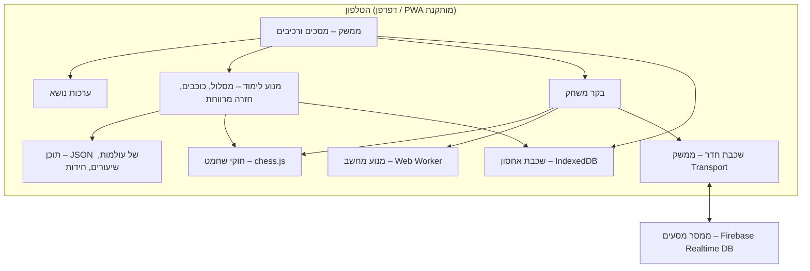

# ארכיטקטורה – אפליקציית לימוד שחמט

אפליקציית רשת סטטית (PWA) לטלפון, בעברית, שמאוחסנת ב-GitHub Pages. כל הנתונים נשמרים מקומית על המכשיר. רכיב הרשת היחיד הוא ממסר מסעים עבור מצב "חדר".

## עקרונות

1. **מקומי קודם** – פרופילים, התקדמות והגדרות נשמרים רק במכשיר. בלי הרשמה ובלי שרת נתונים.
2. **עובד בלי אינטרנט** – אחרי הטעינה הראשונה הכול עובד אופליין, חוץ ממצב החדר.
3. **תוכן כנתונים** – שיעורים, חידות ועולמות מוגדרים בקובצי JSON ולא בקוד. מוסיפים שלב בלי לגעת בלוגיקה.
4. **שכבות מופרדות** – חוקי שחמט, מנוע, אחסון ותקשורת מאחורי ממשקים, כדי שאפשר יהיה להחליף כל אחד מהם.
5. **מותאם לגיל** – כל טקסט וכל התנהגות שתלויים בגיל נקבעים לפי קבוצת הגיל של הפרופיל הפעיל.

## תמונה כללית



## בחירות טכנולוגיות

| תחום | בחירה | למה |
| --- | --- | --- |
| שפה ובנייה | TypeScript + Vite | טיפוסים לחוקי המשחק ולמודל הנתונים, בנייה מהירה |
| ממשק | Preact | קל מאוד (כ-4KB), רכיבים כמו React |
| חוקי שחמט | chess.js | ספרייה בדוקה למסעים חוקיים, שח, מט, פט ו-FEN |
| לוח | SVG משלנו | שליטה מלאה בערכות נושא, אנימציות וגרירה במגע |
| מנוע מחשב | Stockfish (גרסת WASM) ב-Web Worker | רמות 0–20, לא תוקע את הממשק |
| יריב לילדים קטנים | מנוע פשוט משלנו | Stockfish חזק מדי גם ברמה הנמוכה; מנוע שטועה בכוונה נעים יותר לגיל 5–7 |
| אחסון | IndexedDB (עטיפה קטנה משלנו, `src/storage/db.ts`) | יציב יותר מ-localStorage; בלי ספרייה נוספת |
| אופליין | Service Worker (vite-plugin-pwa) | התקנה למסך הבית ועבודה בלי רשת |
| חדרים | Firebase Realtime Database, תוכנית חינמית | אמין ברשתות סלולריות, בלי שרת משלנו |
| הקראה | Web Speech API | הקראה בעברית לגיל 5–7, כשיש קול עברי במכשיר |
| אירוח | GitHub Pages + GitHub Actions | פריסה אוטומטית בכל דחיפה לענף הראשי |

**רישוי**: Stockfish מופץ ברישיון GPL-3. מכיוון שהמאגר ציבורי, הכי פשוט לפרסם גם את הפרויקט כולו ב-GPL-3.

## מבנה תיקיות

```
src/
  app/            ניתוב, מצב גלובלי, פרופיל פעיל
  screens/        מסך לכל מסך ברשימת המסכים
  components/     Board, Piece, StarBar, Avatar, Button...
  chess/          עטיפה ל-chess.js (משחק אמיתי), chessPosition ללוח
  engine/         ממשק Engine, StockfishEngine, KidEngine, worker
  learning/       types, drill (תנועת כלים בתרגולים), goals (בודק מטרות ופותר),
                  progress (כוכבים ופתיחת תחנות), demo, feedback, text (גיל ומין)
  content/
    index.ts      טעינת העולמות ובדיקת תקינות
    worlds/       01-board.json, 02-rook.json ... 07-pawn.json
    puzzles/      puzzles-mate1.json, puzzles-tactics.json ...
    texts/        טקסטים לפי קבוצת גיל: he-kids.json, he-teen.json, he-adult.json
  storage/        ממשק Storage, מימוש IndexedDB, גיבוי ושחזור
  net/            ממשק Transport, FirebaseTransport, ניהול חדר
  themes/         space, forest, clean... (צבעים, כלים, צלילים)
  audio/          צלילים והקראה
public/
  icons/, manifest
```

## מודל נתונים (מקומי)

```ts
type AgeGroup = 'kids5_7' | 'kids8_12' | 'teenAdult';

interface Profile {
  id: string;
  name: string;
  avatar: string;
  ageGroup: AgeGroup;
  gender?: 'boy' | 'girl' | 'other';   // משמש רק להצעת ערכת נושא
  themeId: string;
  pinHash?: string;                    // PIN אופציונלי לפרופיל
  createdAt: number;
}

interface Progress {
  profileId: string;
  stations: Record<string, { stars: 0 | 1 | 2 | 3; completedAt?: number }>;
  review: Record<string, { due: number; interval: number }>; // חזרה מרווחת
  engineLevel: number;                 // הרמה הנוכחית מול המחשב
  stats: { games: number; wins: number; puzzlesSolved: number };
}

interface Settings {
  profileId: string;
  sound: boolean;
  narration: boolean;
  hints: 'always' | 'onRequest' | 'off';
}
```

מאגרים ב-IndexedDB: `profiles`, `progress`, `settings`, `meta` (גרסת סכמה).
בהפעלה הראשונה מבקשים `navigator.storage.persist()` כדי להקטין את הסיכוי שהדפדפן ימחק את הנתונים.
**גיבוי**: ייצוא כל המאגרים לקובץ JSON אחד, וייבוא ממנו. בגיבוי יש מספר גרסה כדי שאפשר יהיה להמיר גיבויים ישנים.

## מודל התוכן

כל עולם הוא קובץ JSON ב-`src/content/worlds/`, ונרשם ברשימה ב-`src/content/index.ts`. הטיפוסים ב-`src/learning/types.ts`.

- **עולם**: `id`, `part` (חלק במסלול: 1 = הלוח, 2 = הכלים), `title`, `icon`, `character` אופציונלית (דמות: שם, כלי, משפט פתיחה לכל גיל), ו-`stations`.
- **תחנה**: `id` ייחודי בכל המסלול, `type` (`lesson` | `minigame`), `title`, `icon`, `fen`, `goal`, `stars`, `text` לכל קבוצת גיל.
  לשיעור יש גם `task` (משימת התרגול) ו-`demo` (הדגמה מונפשת), ואפשר `demoFen` נפרד.
- **פנייה לפי מין בתוך הטקסט**: `{גע|געי}` או `{אתה משחק|את משחקת|משחקים}` (הצורה השלישית למי שלא בחר מין). `learning/text.ts` מחליף אותן דרך `byGender`.
- **הצד הלומד** הוא הצד שבתור ב-FEN (תמיד לבן בתוכן הנוכחי). הצד השני לא זז אף פעם.

```json
{
  "id": "rook-stars",
  "type": "minigame",
  "title": "כוכבים לצריח",
  "icon": "⭐",
  "fen": "8/8/8/8/8/8/8/R7 w - - 0 1",
  "goal": { "kind": "collectStars", "squares": ["a4", "f4", "f8", "c8"] },
  "stars": { "3": 4, "2": 6 },
  "text": {
    "kids5_7": "{אסוף|אספי} את כל הכוכבים!",
    "kids8_12": "{אסוף|אספי} את כל הכוכבים בכמה שפחות מסעים...",
    "teenAdult": "{אסוף|אספי} את ארבעת הכוכבים במספר מסעים מינימלי."
  }
}
```

**סוגי מטרות** (מומשו בשלב 2):

| מטרה | משמעות |
| --- | --- |
| `collectStars` | לעצור על כל משבצות הכוכב (מעבר מעל כוכב לא אוסף אותו) |
| `captureAll` | לאכול את כל כלי היריב, או רק את אלה שב-`targets` (השאר חוסמים) |
| `reachSquare` | להביא כלי למשבצת מסוימת, שמסומנת בדגל |
| `promote` | להביא רגלי לשורה האחרונה ולבחור כלי |
| `tapSquares` | שיעורי הלוח: לגעת במשבצות הנכונות. `ordered` מבקש אותן אחת אחת לפי שם, `area` מסמן אזור |

מתוכננות לשלבים הבאים: `mateIn`, `escapeCheck`, `defend`, `findBestMove`.

**צעדי הדגמה** (`demo`): כל צעד יכול להחליף עמדה (`fen`), להזיז כלי (`move`), לסמן משבצות (`highlight`, `highlightAlt`), לצייר חצים ונקודות (`arrows`, `dots`), להראות את המסעים של כלי (`showMoves`), לכתוב שמות משבצות (`labels`), ולהציג כיתוב קצר (`caption`). `ms` קובע כמה זמן הצעד נשאר.

### החלטה: תנועת כלים בתרגולים בלי chess.js

chess.js דורש שני מלכים על הלוח ותורות מתחלפים. בתרגולים רק הלומד זז, ולוח של צריח לבד עם מלכים "סתם" מבלבל מתחיל. לכן `src/learning/drill.ts` מחשב לבד את המסעים של כל כלי: החלקה לצריח, רץ ומלכה, קפיצה לפרש, צעד אחד למלך, וברגלי צעד, צעד כפול מהשורה ההתחלתית, אכילה באלכסון והכתרה. בתרגולים אין שח, הצרחה או הכאה דרך הילוכו. אלה נלמדים בשלב 4, שם יתאים להשתמש ב-chess.js עם עמדות אמיתיות.
chess.js נשאר המקור לחוקים במשחק האמיתי. הלוח (`Board`) מקבל ממשק `BoardPosition` (`get`, `canPick`, `movesFrom`), כך שאותו רכיב משרת גם משחק chess.js (`chessPosition`) וגם תרגולים.

### בדיקת תוכן

`src/content/index.ts` בודק כל תחנה בזמן הטעינה: FEN תקין, משבצות תקינות, טקסט לשלוש קבוצות הגיל, כוכב לא על משבצת תפוסה, יש מה לאכול, ושיש פתרון (חיפוש BFS ב-`goals.ts`). תחנה עם שגיאה נרשמת בקונסולה ולא מוצגת במפה, כך שטעות בתוכן לא מפילה את האפליקציה. אזהרה (למשל סף שלושה כוכבים שנמוך מהפתרון הקצר ביותר) רק נרשמת.
`tests/content/check.ts` מריץ את אותה בדיקה מהטרמינל ומדפיס את הפתרון הקצר לכל תחנה (`bun tests/content/check.ts` או `npx tsx tests/content/check.ts`).

### כוכבים, רמזים ופתיחת תחנות

- **כוכבים**: `stars: {"3": n, "2": m}`. עד n מסעים מקבלים 3 כוכבים, ועד m מסעים 2. מעבר לזה מקבלים 1. ב-`tapSquares` סופרים טעויות במקום מסעים. סיום תמיד שווה לפחות כוכב אחד.
- **רמז**: במשחקון, חץ מהכלי למשבצת של המסע הבא בפתרון הקצר. ב-`tapSquares` המשבצת הבאה מהבהבת. כל רמז מוריד כוכב אחד מהתוצאה המקסימלית.
- **פתיחה**: תחנה נפתחת כשהתחנה הקודמת באותו עולם הושלמה. התחנה הראשונה בעולם נפתחת כשכל התחנות בעולם הקודם הושלמו. תחנה שהושלמה נשארת פתוחה תמיד.
- **שמירה**: `Progress.stations[id] = { stars, completedAt }`. נשמר הציון הטוב ביותר וזמן ההשלמה הראשון. אין שינוי במבנה ה-IndexedDB (`SCHEMA_VERSION` נשאר 1).
- **משוב על מסע לא חוקי**: `learning/feedback.ts` מסביר למתחיל למה אי אפשר (למשל "יש כלי בדרך" או "הרגלי לא אוכל ישר").

**מקור לחידות**: מאגר החידות של Lichess פתוח לשימוש חופשי ומסווג לפי נושא ורמה. נסנן ממנו מראש קבצים קטנים לכל נושא ורמה.

## מנוע המחשב

```ts
interface Engine {
  init(): Promise<void>;
  bestMove(fen: string, level: number): Promise<string>; // מסע בפורמט UCI
  evaluate?(fen: string): Promise<number>;               // לסיכום המשחק
  dispose(): void;
}
```

- **רמות 1–2**: `KidEngine` – בוחר מסעים חוקיים באקראי, מעדיף הכאות, ומפספס בכוונה חלק מהאיומים.
- **רמות 3–8**: `StockfishEngine` עם Skill Level ועומק חיפוש מוגבלים.
- **התאמה אוטומטית**: אחרי 3 ניצחונות ברצף מוצע לעלות רמה, ואחרי 3 הפסדים ברצף מוצע לרדת.
- **סיכום משחק**: הערכת עמדה לפני כל מסע ואחריו מזהה את המסע הטוב ביותר ואת הטעות הגדולה ביותר.

## מצב חדר

```ts
interface Transport {
  createRoom(): Promise<{ code: string }>;
  joinRoom(code: string): Promise<void>;
  sendMove(uci: string, ply: number): void;
  sendReaction(id: ReactionId): void;   // רק סמלים מוכנים מראש
  onMessage(cb: (msg: RoomMessage) => void): void;
  leave(): void;
}
```

- **קוד חדר**: 5 תווים מאלפבית בלי תווים מבלבלים (כמו 0/O או 1/I), ו-QR לסריקה.
- **מה עובר**: שם תצוגה, צבע, מסעים עם מספר מסע, סמלי רגש מוכנים מראש. בלי צ'אט חופשי.
- **אמינות**: כל מכשיר מאמת כל מסע עם chess.js. אם יש חוסר התאמה, המכשירים מסתנכרנים לפי רשימת המסעים המלאה.
- **ניקוי**: חדר נמחק בסוף המשחק או אחרי שעתיים בלי פעילות. כללי האבטחה ב-Firebase מתירים קריאה וכתיבה רק לחדר שהמשתמש יודע את הקוד שלו.
- **החלפה עתידית**: בזכות ממשק `Transport` אפשר לעבור לחיבור ישיר בין המכשירים (WebRTC) בלי לשנות את בקר המשחק.

## ערכות נושא והתאמה לגיל

- ערכת נושא = צבעי לוח, סט כלים ב-SVG, רקע, צלילים ואווטארים. כל ערכה היא תיקייה תחת `themes/`.
- ערכת ברירת המחדל מוצעת לפי קבוצת גיל ומין, וכל פרופיל יכול לבחור כל ערכה.
- `texts/` מחזיק גרסת טקסט לכל קבוצת גיל. לגיל 5–7 הטקסטים מוקראים כשההקראה פעילה.

## עברית ו-RTL

- הממשק כולו `dir="rtl"`. הלוח עצמו תמיד בכיוון LTR, כדי שהטורים a–h יופיעו כמו בכל לוח שחמט.
- שמות הכלים בעברית: מלך, מלכה, צריח, רץ, פרש, רגלי.
- סימון המשבצות נשאר באותיות לטיניות (e4), כמו בשחמט התחרותי בישראל.
- טקסט תוכן עובר דרך `RichText`: שמות משבצות ומספרים נעטפים ב-`<bdi dir="ltr">` (ושמות המשבצות מודגשים), ולסמלי כלים מתווסף `︎` כדי שלא יוצגו כאימוג'י באייפון.

## ביצועים ונגישות

- טעינה ראשונה עד 300KB בלי Stockfish. המנוע נטען רק כשנכנסים למשחק מול המחשב.
- גודל מגע מינימלי של 44 פיקסלים, גרירה וגם הקשה (בחירת כלי ואז משבצת).
- ניגודיות מספקת בכל ערכה, ותמיכה בהקטנת אנימציות.
