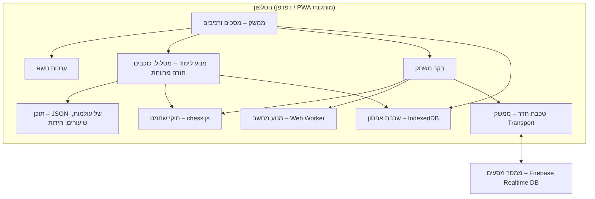

# ארכיטקטורה – אפליקציית לימוד שחמט

אפליקציית רשת סטטית (PWA) לטלפון, בעברית, שמאוחסנת ב-Firebase Hosting. כל הנתונים נשמרים מקומית על המכשיר. רכיב הרשת היחיד הוא ממסר מסעים עבור מצב "חדר".

## עקרונות

1. **מקומי קודם** – פרופילים, התקדמות והגדרות נשמרים רק במכשיר. בלי הרשמה ובלי שרת נתונים.
2. **עובד בלי אינטרנט** – אחרי הטעינה הראשונה הכול עובד אופליין, חוץ ממצב החדר.
3. **תוכן כנתונים** – שיעורים, חידות ועולמות מוגדרים בקובצי JSON ולא בקוד. מוסיפים שלב בלי לגעת בלוגיקה.
4. **שכבות מופרדות** – חוקי שחמט, מנוע, אחסון ותקשורת מאחורי ממשקים, כדי שאפשר יהיה להחליף כל אחד מהם.
5. **מותאם לגיל** – כל טקסט וכל התנהגות שתלויים בגיל נקבעים לפי קבוצת הגיל של הפרופיל הפעיל.

## תמונה כללית



## בחירות טכנולוגיות

| תחום | בחירה | למה |
| --- | --- | --- |
| שפה ובנייה | TypeScript + Vite | טיפוסים לחוקי המשחק ולמודל הנתונים, בנייה מהירה |
| ממשק | Preact | קל מאוד (כ-4KB), רכיבים כמו React |
| חוקי שחמט | chess.js | ספרייה בדוקה למסעים חוקיים, שח, מט, פט ו-FEN |
| לוח | SVG משלנו | שליטה מלאה בערכות נושא, אנימציות וגרירה במגע |
| מנוע מחשב | Stockfish (גרסת WASM) ב-Web Worker | רמות 0–20, לא תוקע את הממשק |
| יריב לילדים קטנים | מנוע פשוט משלנו | Stockfish חזק מדי גם ברמה הנמוכה; מנוע שטועה בכוונה נעים יותר לגיל 5–7 |
| אחסון | IndexedDB (עטיפה קטנה משלנו, `src/storage/db.ts`) | יציב יותר מ-localStorage; בלי ספרייה נוספת |
| אופליין | Service Worker (vite-plugin-pwa) | התקנה למסך הבית ועבודה בלי רשת |
| חדרים | Firebase Realtime Database, תוכנית חינמית, דרך REST + ‏Server-Sent Events (בלי SDK) | אמין ברשתות סלולריות, בלי שרת משלנו, ובלי עשרות KB של ספרייה |
| הקראה | Web Speech API | הקראה בעברית לגיל 5–7, כשיש קול עברי במכשיר |
| אירוח | Firebase Hosting + GitHub Actions | פריסה אוטומטית בכל דחיפה לענף הראשי (עד אוקטובר 2026 – GitHub Pages; עבר כדי שהמאגר יוכל להיות פרטי) |

**רישוי**: Stockfish מופץ ברישיון GPL-3. מכיוון שהמאגר ציבורי, הכי פשוט לפרסם גם את הפרויקט כולו ב-GPL-3.

## מבנה תיקיות

```
src/
  app/            ניתוב, מצב גלובלי, פרופיל פעיל; version (גרסה ותאריך בנייה), errorLog (יומן שגיאות מקומי)
  screens/        מסך לכל מסך ברשימת המסכים
  components/     Board, Piece, StarBar, Avatar, Button...
  chess/          עטיפה ל-chess.js (משחק אמיתי), chessPosition ללוח
  engine/         ממשק Engine, levels, KidEngine (+worker), StockfishEngine, uci, random
  game/           savedGame (משחק פתוח), analysis (סיכום משחק)
  learning/       types, drill (תנועת כלים בתרגולים), goals (בודק מטרות ופותר),
                  real (מטרות על עמדות אמיתיות, chess.js), coach (מאמן למשחק מודרך),
                  progress (כוכבים, פתיחת תחנות, חידות, מבחן כניסה), review (חזרה מרווחת),
                  demo, feedback, text (גיל ומין)
  content/
    index.ts      טעינת העולמות (בעצלות) ובדיקת תקינות
    worlds/       01-board.json ... 07-pawn.json (חלקים 1–2), 08-capture.json ... 13-opening.json (חלקים 3–8), all.ts
    puzzles/      index.ts + קובץ JSON לכל נושא (mateIn1.json, fork.json ...), נוצרים ב-scripts/puzzles.ts
    placement.ts  שאלות מבחן הכניסה
    texts/        טקסטים לפי קבוצת גיל: he-kids.json, he-teen.json, he-adult.json
  storage/        db (IndexedDB), backup (גיבוי ושחזור, נטען בעצלות), backupState (תזכורת הגיבוי)
  net/            transport (ממשק והודעות), rules (הכללים ב-TS), firebase (REST + SSE), local (בין לשוניות),
                  room (RoomClient), openRoom (החדר הפתוח), qr, config (כתובת המסד)
  app/lazy.tsx    טעינה עצלה של מסכים
  themes/         index (רשימה, טעינה והחלה), types, clean (מוטמעת), space, forest (נטענות בעצלות),
                  pieceSprite (ציורי הכלים), art (רקעי SVG)
  audio/          sound (צלילים ב-Web Audio), speech (הקראה בעברית)
  profiles/       profiles, settings (הגדרות לכל פרופיל), pin (PIN אופציונלי)
scripts/
  puzzles.ts      סינון מאגר החידות של Lichess לקבצים קטנים
  screens/        … BackupScreen, AboutScreen (+ family.css), נטענים בעצלות
scripts/
  og-image.ts     תמונת השיתוף (og-image.png), og-image-shot.cjs מצלם אותה
  screenshots.cjs צילומי המסך של ה-README (docs/screenshots)
public/
  icons/, manifest, og-image.png (תמונת השיתוף; לא נשמרת מראש ב-Service Worker)
  fonts/          rubik.woff2 (עברית ולטינית, 400–800) + OFL.txt
  engine/         Stockfish 19 lite (JS + wasm), נטען רק כשצריך
```

## מודל נתונים (מקומי)

```ts
type AgeGroup = 'kids5_7' | 'kids8_12' | 'teenAdult';

interface Profile {
  id: string;
  name: string;
  avatar: string;
  ageGroup: AgeGroup;
  gender?: 'boy' | 'girl' | 'other';   // משמש רק להצעת ערכת נושא
  themeId: string;                     // 'clean' | 'space' | 'forest'; מזהה לא מוכר מוצג כ-clean
  pinHash?: string;                    // PIN אופציונלי: SHA-256 של salt + הספרות
  pinSalt?: string;
  createdAt: number;
}

interface Progress {
  profileId: string;
  stations: Record<string, { stars: 0 | 1 | 2 | 3; completedAt?: number }>;
  review: Record<string, { due: number; interval: number }>; // חזרה מרווחת
  engineLevel: number;                 // הרמה הנוכחית מול המחשב
  stats: { games: number; wins: number; draws: number; puzzlesSolved: number };
  vsComputer: Record<string, { games: number; wins: number; losses: number; draws: number }>; // לפי רמה
  computerStreak: { level: number; result: 'win' | 'loss'; count: number } | null;
  puzzles: Record<string, { solvedAt: number; clean: boolean }>; // לפי "theme:id"
  daily: string | null;                // היום המקומי (YYYY-MM-DD) שבו נפתרה החידה היומית
  placement: { passedPart: number; score: number; at: number; skipped?: boolean } | null;
}

interface Settings {                   // מאגר settings, רשומה לכל פרופיל (נוצרת בשינוי הראשון)
  profileId: string;
  sound: boolean;                      // ברירת מחדל: פעיל
  narration: boolean;                  // הקראה אוטומטית. ברירת מחדל: פעיל רק לגיל 5–7
  speechHelpSeen: boolean;             // ההסבר להורה על קול עברי כבר הוצג
}
```

הגדרת רמזים (`always`/`onRequest`/`off`) תוכננה אבל לא מומשה בשלב 5: הרמז בתחנות נשאר "לפי בקשה" (עולה כוכב), ובמשחק יש כבר "להראות לאן אפשר לזוז". אם יתברר שצריך, מוסיפים שדה ל-`Settings`.

מאגרים ב-IndexedDB: `profiles`, `progress`, `settings`, `meta`. ב-`meta` יש רק מצב של המכשיר הזה: `currentGame` (משחק פתוח), `lastProfileId`, ‏`room:<profileId>` (חדר פתוח), `backup` (מתי גובה, והאם התזכורת נדחתה) ו-`errorLog`.
שדות חדשים בתוך רשומה (כמו `vsComputer`, ובשלב 4 `puzzles`, `daily` ו-`placement`) לא דורשים העלאת `SCHEMA_VERSION`: `getProgress` ממזג אותם עם ברירות מחדל. שלבים 3–5 לא שינו את מבנה המאגרים (`SCHEMA_VERSION` נשאר 1): בשלב 5 `pinHash`/`pinSalt` הם שדות אופציונליים ברשומת הפרופיל, ומאגר `settings` קיים מהשלב הראשון (`loadSettings` ממזג עם ברירות המחדל לפי גיל).
בהפעלה הראשונה מבקשים `navigator.storage.persist()` כדי להקטין את הסיכוי שהדפדפן ימחק את הנתונים.
**גיבוי**: ייצוא כל המשפחה לקובץ JSON אחד, וייבוא ממנו – ראו "גיבוי ושחזור" למטה.

## גיבוי ושחזור (`storage/backup.ts`, `screens/BackupScreen.tsx`)

כל מה שבטלפון הוא של המשפחה, ואין שרת. גיבוי לקובץ הוא הדרך היחידה לעבור לטלפון חדש, או לא לאבד הכול כשטלפון הולך לאיבוד.

```ts
interface Backup {
  format: 'chessit-backup';
  version: 1;            // גרסת הפורמט של הקובץ (BACKUP_VERSION)
  exportedAt: string;    // ISO
  schemaVersion: number; // SCHEMA_VERSION של המכשיר שיצר אותו (לתיעוד)
  app: string;           // גרסת האפליקציה
  profiles: Profile[];
  progress: Progress[];
  settings: Settings[];
}
```

- **מה בקובץ**: הפרופילים, ההתקדמות וההגדרות. **ה-PIN** נשמר בדיוק כמו במכשיר – `pinHash` ו-`pinSalt` – אף פעם לא הספרות.
- **מה לא** (החלטה): `meta`. הוא מתאר את המכשיר ואת הרגע, לא את המשפחה: פרופיל אחרון, משחק פתוח (חצי משחק שמשוחזר בטלפון אחר מבלבל יותר משהוא עוזר), חדר פתוח (ה-ticket שלו שייך לטלפון הזה – שני טלפונים עם אותו ticket היו "אותו שחקן"), יומן שגיאות ומצב התזכורת.
- **שם הקובץ**: `chessit-backup-2026-10-03.json` (תאריך מקומי).
- **שמירה**: "שליחה או שמירה" – `navigator.share` עם קובץ, כשהדפדפן מאפשר (`navigator.canShare({ files })`; באייפון "שמירה בקבצים", וואטסאפ לעצמך וכו'), ו"הורדת קובץ" (‏`<a download>`) תמיד. Chrome באנדרואיד לא משתף קובצי JSON, ולכן שם מופיעה רק ההורדה.
- **בדיקה לפני הכול** (`parseBackup` → `checkBackup`): קובץ עד 5MB, JSON, `format` נכון, `version` שלם. גרסה גדולה מ-`BACKUP_VERSION` → "הגיבוי נוצר בגרסה חדשה יותר, כדאי לעדכן". כל שדה נבדק: מזהים (לא `guest`/`computer`), שם, גיל ומין מהרשימה, PIN בפורמט של hash ותמיד עם salt, התקדמות והגדרות רק לפרופילים שבקובץ ופעם אחת, כוכבים 0–3, רמות 1–8, תאריכים. שדות לא מוכרים נזרקים, ושדות שחסרים (גיבוי מגרסה מוקדמת) מקבלים ברירת מחדל. שגיאה אחת → כל הקובץ נדחה, עם משפט שמסביר, ולפני שנכתב משהו.
- **המרה של גיבויים ישנים**: `MIGRATIONS[n]` הופך קובץ בגרסה n לגרסה n+1, ו-`migrate` מריץ אותם ברצף. בגרסה 1 אין עדיין מה להמיר. כששדה במבנה משתנה (לא רק נוסף): מעלים את `BACKUP_VERSION`, מוסיפים צעד, ובדיקה ב-`tests/storage/check.ts`.
- **תצוגה מקדימה**: "נמצאו 3 פרופילים בגיבוי מ-3.10.2026", עם דמות, שם, 🔒, כוכבים, תחנות ומשחקים, וסימון "כבר בטלפון" לפרופיל עם אותו מזהה. עד כאן לא נכתב כלום.
- **שחזור**: בטלפון בלי פרופילים – "שחזור" אחד. אחרת:
  - **להוסיף**: פרופילים חדשים נכנסים. לכל פרופיל שכבר בטלפון – בחירה: "להשאיר את מה שבטלפון" (ברירת המחדל) או "לקחת מהגיבוי", עם הכוכבים של כל אחד כדי שיהיה קל להחליט.
  - **להחליף הכול**: רשימה של מה שיימחק, ואז שאלת הורה (`ParentCheck`).
  - הכתיבה היא **טרנזקציה אחת** ב-IndexedDB (`dbWrite`), כך שכישלון באמצע לא משאיר חצי שחזור. אחריה מנוקים ב-`meta` משחק פתוח, חדר ופרופיל אחרון של פרופילים שכבר לא קיימים (`restoreOps`, פונקציה טהורה שנבדקת בטרמינל). בסוף חוזרים לבחירת פרופיל.
- **גם כטקסט**: "📋 העתקה כטקסט" מעתיק את אותו גיבוי כשורה אחת של JSON (כשהטלפון לא מרשה העתקה אוטומטית – הטקסט מוצג בתיבה לסימון והעתקה ידנית). "📋 הדבקת גיבוי כטקסט" פותח תיבה (ובטלפונים שמאפשרים – גם "הדבקה מההעתקה"), והטקסט עובר את אותה בדיקה (`parseBackup`) ואותה תצוגה מקדימה כמו קובץ. נועד בעיקר לאייפון, שם להעביר קובץ בין הדפדפן לאפליקציה שבמסך הבית מסורבל.
- **מאיפה**: הגדרות ← "כל המשפחה" ← 💾 גיבוי ושחזור; בחירת הפרופיל (קישור בתחתית); ובמסך הפתיחה של טלפון חדש: "📥 יש לך גיבוי? שחזור מקובץ או מטקסט".

### דפדפן מול אייקון באייפון (`app/install.ts`, `components/BrowserNotice.tsx`)

באייפון ובאייפד, אפליקציה שנוספה למסך הבית מקבלת אחסון נפרד מ-Safari, גם באותה כתובת: פרופילים שנוצרו או שוחזרו בדפדפן לא מופיעים באייקון, ולהפך (באנדרואיד Chrome והאפליקציה המותקנת חולקים את הנתונים). לכן, ב-iOS כשהאפליקציה לא פתוחה מהאייקון (`inIosBrowser`):
- **מסך ראשון** (`BrowserNotice`): הסבר קצר, איך מוסיפים למסך הבית, ו"להמשיך בדפדפן בכל זאת". הבחירה נשמרת ב-`sessionStorage` (בלשונית חדשה שואלים שוב).
- **שורת תזכורת** (`BrowserBanner`) בבחירת הפרופיל, בטופס פרופיל חדש ובשחזור.
- לבדיקות: `?browser-notice=1` ב-localhost מתנהג כמו דפדפן באייפון.

### הכתובות הישנות (`legacy-pages/`)

בשתי הכתובות הישנות יש רק מסך "עבר לכתובת חדשה", שמפנה ל-`chessit-liorhen9.web.app`: ב-`liorhen9.github.io/ChessIt` (GitHub Pages, `.github/workflows/legacy-pages.yml`), וב-`chessit-6d389.web.app` – האתר הראשון של פרויקט Firebase, שאי אפשר לשנות את שמו (מתפרסם עם האפליקציה ב-`deploy.yml`, האתר השני ב-`firebase.json`). `scripts/legacy-site.sh` מרכיב את המסך לכל כתובת (הנתיב שבו הייתה האפליקציה: `/ChessIt/` או `/`). המסך קורא את ה-IndexedDB של הכתובת הישנה (קריאה בלבד, בלי ליצור אותו), ושומר גיבוי כקובץ או כטקסט באותו פורמט; `sw.js` שם מחליף את ה-Service Worker של האפליקציה הישנה, מוחק את המטמון שלה ומסיר את עצמו.
- **תזכורת** (`storage/backupState.ts`, בטעינה הראשונה): כרטיס עדין בבית של פרופיל שהשלים 20 תחנות, אם מהטלפון הזה עוד לא נעשה גיבוי. "לגבות עכשיו" או "לא עכשיו" – ואחרי "לא עכשיו" היא לא חוזרת (פעם אחת לטלפון). גיבוי מוצלח (שמירה או שיתוף שלא בוטל) רושם `lastBackupAt`, שמוצג במסך הגיבוי.

### שאלת הורה (`components/ParentCheck.tsx`)

תרגיל כפל (דו-ספרתי × חד-ספרתי) שמבוגר פותר בראש וילד בן 5–8 בדרך כלל לא. שומר על מה שרק הורה צריך לעשות: איפוס PIN שנשכח, "להחליף הכול" בשחזור, ו"מחיקת כל הנתונים". נבחר במקום PIN כי PIN שייך לפרופיל אחד (לפעמים של ילד), והפעולות האלה הן של כל המשפחה.

## מודל התוכן

כל עולם הוא קובץ JSON ב-`src/content/worlds/`, ונרשם ברשימה ב-`src/content/worlds/all.ts`. הטיפוסים ב-`src/learning/types.ts`.

- **עולם**: `id`, `part` (חלק במסלול: 1 = הלוח, 2 = הכלים, 3 = אוכלים ושומרים, 4 = שח, 5 = מט, 6 = חוקים מיוחדים, 7 = טריקים, 8 = פתיחה ומשחק שלם), `title`, `icon`, `character` אופציונלית (דמות: שם, כלי, משפט פתיחה לכל גיל), `stations`, ו-`puzzles` אופציונלי (`{ theme, count }`: צומת "חידות בונוס" בסוף העולם, שלא נועל שום דבר).
- **תחנה**: `id` ייחודי בכל המסלול, `type` (`lesson` | `minigame`), `title`, `icon`, `fen`, `goal`, `stars`, `text` לכל קבוצת גיל.
  לשיעור יש גם `task` (משימת התרגול) ו-`demo` (הדגמה מונפשת), ואפשר `demoFen` נפרד.
- **פנייה לפי מין בתוך הטקסט**: `{גע|געי}` או `{אתה משחק|את משחקת|משחקים}` (הצורה השלישית למי שלא בחר מין). `learning/text.ts` מחליף אותן דרך `byGender`.
- **הצד הלומד** הוא הצד שבתור ב-FEN (תמיד לבן בתוכן המסלול; בחידות הלוח מסתובב לפי הצד שמשחק). בתרגולים של חלקים 1–2 הצד השני לא זז אף פעם; מחלק 3 העמדות אמיתיות והצד השני עונה.

```json
{
  "id": "rook-stars",
  "type": "minigame",
  "title": "כוכבים לצריח",
  "icon": "⭐",
  "fen": "8/8/8/8/8/8/8/R7 w - - 0 1",
  "goal": { "kind": "collectStars", "squares": ["a4", "f4", "f8", "c8"] },
  "stars": { "3": 4, "2": 6 },
  "text": {
    "kids5_7": "{אסוף|אספי} את כל הכוכבים!",
    "kids8_12": "{אסוף|אספי} את כל הכוכבים בכמה שפחות מסעים...",
    "teenAdult": "{אסוף|אספי} את ארבעת הכוכבים במספר מסעים מינימלי."
  }
}
```

**סוגי מטרות** (מומשו בשלב 2):

| מטרה | משמעות |
| --- | --- |
| `collectStars` | לעצור על כל משבצות הכוכב (מעבר מעל כוכב לא אוסף אותו) |
| `captureAll` | לאכול את כל כלי היריב, או רק את אלה שב-`targets` (השאר חוסמים) |
| `reachSquare` | להביא כלי למשבצת מסוימת, שמסומנת בדגל |
| `promote` | להביא חייל לשורה האחרונה ולבחור כלי |
| `tapSquares` | שיעורי הלוח: לגעת במשבצות הנכונות. `ordered` מבקש אותן אחת אחת לפי שם, `area` מסמן אזור |

**מטרות על עמדות אמיתיות** (שלב 4, `learning/real.ts`, רצות על chess.js עם שני מלכים, שח וכל החוקים):

| מטרה | משמעות |
| --- | --- |
| `mateIn` | מט בתוך `n` מסעים (1–3). הצד השני משיב בהגנה הטובה ביותר |
| `escapeCheck` | לצאת משח. `ways` מגביל את הדרך (`move` בריחה, `block` חסימה, `capture` אכילה). עם `findAll` צריך למצוא את כל הדרכים, והלוח חוזר להתחלה אחרי כל אחת |
| `defend` | להציל את הכלי שב-`square`: אחרי המסע אי אפשר לאכול אותו בחינם או בכלי זול ממנו, ולא נשאר כלי שווה יותר בסכנה |
| `findBestMove` | מסע נכון אחד מתוך `moves` (UCI), או כל שח (`accept: "check"`). עם `line`: רצף מתוסרט – הלומד, התשובה, הלומד – כמו חידת Lichess. מט במסע האחרון תמיד מתקבל |
| `playOut` | משחקים עד מט (`until: "mate"`) או מספר מסעים, מול `"defender"` (מלך בודד) או רמת מחשב 1–8. עם `coach` מגיעה הערה על כל מסע, ואפשר לבטל מסע |

שדות נוספים לתחנה עם מטרה כזו: `more` (עוד עמדות באותה תחנה – "לוח 2/3"), `lastMove` (המסע שהיריב עשה עכשיו, מודגש, למשל להכאה דרך הילוכו), ו-`wrong` (מה לומר אחרי מסע שגוי).
**כוכבים**: במטרות האלה סופרים טעויות (`{"3": 0, "2": 1}` = שלושה בלי טעויות, שניים עם אחת), חוץ מ-`playOut` בלי מאמן, שבו סופרים מסעים עד המט. במשחק מודרך "טעות" היא מסע שהמאמן סימן כחלש. טעות היא מסע חוקי שגוי; מסע לא חוקי מקבל רק הסבר ("המלך שלך בשח! קודם צריך להציל אותו", "הפרש מגן על המלך: אם יזוז, המלך יהיה בשח", ומתי אסור להצריח).

### החלטה: תשובת היריב מחושבת, לא כתובה בתוכן

אפשרות אחת הייתה לכתוב בקובץ התוכן רשימת מסעים לכל ענף. בחרנו לחשב, כי כך הלומד יכול לפתור בכל דרך נכונה (למשל כל מט, לא רק המט שכותב התוכן חשב עליו), וכותב תוכן לא צריך לפרט עץ שלם. התשובה תמיד דטרמיניסטית, כך שאותה עמדה מקבלת אותה תשובה:

- `mateIn`: חיפוש מלא (n ≤ 3) של התשובה שמרחיקה את המט הכי הרבה. כל מסע של הלומד נבדק: אם אחריו כבר אין מט מאולץ במסעים שנשארו, זו טעות והמסע חוזר.
- `playOut` מול `"defender"`: מלך בודד שאוכל כלי לא שמור אם אפשר, ואחרת שומר על כמה שיותר משבצות ונשאר קרוב למרכז. הרמז ובדיקת התוכן משתמשים ב-`squeezeMove` (חיפוש קצר שמצמצם את המלך בלי להשאיר כלים בסכנה, ומוצא מט).
- `playOut` מול רמה: KidEngine (רמות 1–2, עם `?seed=` לבדיקות) או Stockfish (3–8, ואם לא נטען – רמה 2).
- היוצא מן הכלל: `findBestMove` עם `line`, שם התשובה מתוסרטת – כי זה מה שמרכיב רצף טקטי (מזלג → המלך בורח → אוכלים את הצריח), וכך גם חידות Lichess בנויות.

### המאמן (`learning/coach.ts`)

במשחק מודרך, אחרי כל מסע: מט או מט שהוחמץ, כלי שנשאר בסכנה ("זהירות! הפרש ב-f3 יכול להיאכל. אפשר לבטל את המסע"), כלי חינם שהוחמץ, ובעשרת המסעים הראשונים גם עקרונות פתיחה (חייל למרכז, פיתוח, הצרחה, לא להוציא מלכה מוקדם, לא להזיז אותו כלי פעמיים, לא להזיז את המלך). הרמז במשחק מודרך הוא המסע שהמאמן הכי אוהב לפי אותם כללים.

**צעדי הדגמה** (`demo`): כל צעד יכול להחליף עמדה (`fen`), להזיז כלי (`move`), לסמן משבצות (`highlight`, `highlightAlt`), לצייר חצים ונקודות (`arrows`, `dots`), להראות את המסעים של כלי (`showMoves`), לכתוב שמות משבצות (`labels`), ולהציג כיתוב קצר (`caption`). `ms` קובע כמה זמן הצעד נשאר.

### החלטה: תנועת כלים בתרגולים בלי chess.js

chess.js דורש שני מלכים על הלוח ותורות מתחלפים. בתרגולים רק הלומד זז, ולוח של צריח לבד עם מלכים "סתם" מבלבל מתחיל. לכן `src/learning/drill.ts` מחשב לבד את המסעים של כל כלי: החלקה לצריח, רץ ומלכה, קפיצה לפרש, צעד אחד למלך, ובחייל צעד, צעד כפול מהשורה ההתחלתית, אכילה באלכסון והכתרה. בתרגולים אין שח, הצרחה או הכאה דרך הילוכו. אלה נלמדים בשלב 4, שם יתאים להשתמש ב-chess.js עם עמדות אמיתיות.
chess.js נשאר המקור לחוקים במשחק האמיתי. הלוח (`Board`) מקבל ממשק `BoardPosition` (`get`, `canPick`, `movesFrom`), כך שאותו רכיב משרת גם משחק chess.js (`chessPosition`) וגם תרגולים.

### בדיקת תוכן

`src/content/index.ts` בודק כל תחנה בזמן הטעינה: FEN תקין, משבצות תקינות, טקסט לשלוש קבוצות הגיל, כוכב לא על משבצת תפוסה, יש מה לאכול, ושיש פתרון (חיפוש BFS ב-`goals.ts`). תחנה עם שגיאה נרשמת בקונסולה ולא מוצגת במפה, כך שטעות בתוכן לא מפילה את האפליקציה. אזהרה (למשל סף שלושה כוכבים שנמוך מהפתרון הקצר ביותר) רק נרשמת.
בעמדות אמיתיות (`checkReal`): עמדה חוקית (מלך אחד לכל צד, אין חייל בשורה הראשונה או האחרונה, הצד שלא בתור לא בשח, המשחק לא נגמר), וכל סבב ב-`more` נבדק בנפרד. בדפדפן רצות רק הבדיקות המהירות: מט במסע אחד קיים, כל דרכי היציאה משח אפשריות, יש מסע שמציל את הכלי (והוא באמת בסכנה), מסעי `moves` ו-`line` חוקיים. **בדיקות עמוקות** רצות רק בטרמינל: מט ב-2–3 מסעים בלי הגנה, ו-`playOut` מול `"defender"` שבו שחקן הבדיקה (`squeezeMove`) מנצח, עם אזהרה אם סף שלושת הכוכבים נמוך ממספר המסעים שלו.
`tests/content/check.ts` מריץ את הכול מהטרמינל, כולל מבחן הכניסה וכל קובצי החידות, ומדפיס פתרון לכל תחנה (`bun tests/content/check.ts` או `npx tsx tests/content/check.ts`).
התשובות ב-`findBestMove` נבדקו גם מול Stockfish (MultiPV, עומק 14): בכל עמדה המסע המבוקש הוא הטוב ביותר, או קרוב אליו בעמדות של עקרונות פתיחה.

### החלטה: התוכן נטען בעצלות

כל העולמות (כ-84KB אחרי מזעור, 18KB ב-gzip) נמצאים ב-chunk נפרד (`content/worlds/all.ts`, דרך `import()`), והאפליקציה טוענת אותו במסך הטעינה לפני המסך הראשון. `WORLDS` הוא `let` שמתעדכן אחרי `loadContent()`. כך ה-JS הראשי לא גדל עם כל עולם חדש, וה-Service Worker שומר את ה-chunk מראש לעבודה בלי רשת. חידות נטענות רק כשפותחים אותן (קובץ לכל נושא).

### כוכבים, רמזים ופתיחת תחנות

- **כוכבים**: `stars: {"3": n, "2": m}`. עד n מסעים מקבלים 3 כוכבים, ועד m מסעים 2. מעבר לזה מקבלים 1. ב-`tapSquares` סופרים טעויות במקום מסעים. סיום תמיד שווה לפחות כוכב אחד.
- **רמז**: במשחקון, חץ מהכלי למשבצת של המסע הבא בפתרון הקצר. ב-`tapSquares` המשבצת הבאה מהבהבת. כל רמז מוריד כוכב אחד מהתוצאה המקסימלית.
- **פתיחה**: תחנה נפתחת כשהתחנה הקודמת באותו עולם הושלמה. התחנה הראשונה בעולם נפתחת כשכל התחנות בעולם הקודם הושלמו. תחנה שהושלמה נשארת פתוחה תמיד.
- **שמירה**: `Progress.stations[id] = { stars, completedAt }`. נשמר הציון הטוב ביותר וזמן ההשלמה הראשון. אין שינוי במבנה ה-IndexedDB (`SCHEMA_VERSION` נשאר 1).
- **משוב על מסע לא חוקי**: `learning/feedback.ts` מסביר למתחיל למה אי אפשר (למשל "יש כלי בדרך" או "החייל לא אוכל ישר").

- **פתיחה במבחן הכניסה**: עולם שה-`part` שלו קטן או שווה ל-`placement.passedPart` נחשב "עברתי": העולם שאחריו נפתח, וכל התחנות שלו פתוחות כדי שתמיד אפשר יהיה לחזור. "אתה כאן" מדלג על עולמות שעברו.

### חידות (Lichess)

- **מקור**: [מאגר החידות של Lichess](https://database.lichess.org/#puzzles), ברישיון CC0. `scripts/puzzles.ts` קורא את ה-CSV, מסנן לפי נושא (`Themes`), דירוג, פופולריות ומספר משחקים, בודק כל חידה עם chess.js (כל המסעים חוקיים, ונושאי מט נגמרים במט), ושומר עד 80 חידות לנושא, מפוזרות על טווח הדירוג, ב-`src/content/puzzles/<theme>.json`.
- **מה במאגר עכשיו**: סביבת העבודה חסומה ל-database.lichess.org, ולכן הקבצים נוצרו מדגימה ציבורית של המאגר ב-GitHub (999 חידות, `aKevinM/Lichess-Puzzles-Analysis`) – 326 חידות בשבעה נושאים. להרצה על המאגר המלא: מורידים את `lichess_db_puzzle.csv.zst`, פותחים עם `zstd -d`, מריצים `bun scripts/puzzles.ts lichess_db_puzzle.csv`, ובודקים עם `bun tests/content/check.ts`.
- **פורמט**: `{ theme, source, puzzles: [{ id, fen, moves, rating }] }`. המסע הראשון ב-`moves` הוא של היריב: הלוח מציג אותו באנימציה, ואז הלומד משחק. מסע שגוי חוזר ונספר כטעות; במסע האחרון כל מט מתקבל.
- **איפה**: מסך "חידות" (נושא נפתח כשהחלק שמלמד אותו הושלם או סומן במבחן הכניסה), צומת "חידות בונוס" בסוף עולמות 3, 5 ו-7, החידה היומית, והחזרה. ילדים מתחילים מהחידה הקלה ביותר שלא פתרו, ונוער ומבוגרים מדירוג 1000.
- **החידה היומית**: אותה חידה לכל הפרופילים באותו יום מקומי. הנושא מתחלף לפי היום (`mateIn1`, `hangingPiece`, `fork`, `mateIn2`), והחידה נבחרת מתוך החידות עד דירוג 1300. הבית מציג ✅ כש-`progress.daily` הוא היום.

### חזרה מרווחת (`learning/review.ts`)

- תחנה שהסתיימה בפחות משלושה כוכבים, או חידה שנפתרה עם טעות או רמז, נכנסת ל-`Progress.review` עם מועד מחר (מפתחות `s:<station>` ו-`p:<theme>:<id>`).
- המרווחים: 1, 3, 7, 14 ימים, לפי חצות מקומית. פתרון נקי של פריט שהגיע זמנו מקדם אותו למרווח הבא, ואחרי 14 ימים הוא יוצא מהרשימה. פתרון עם טעות מחזיר אותו להתחלה. פתרון נקי לפני הזמן לא משנה כלום.
- בבית מופיע כרטיס "חזרה" רק כשיש פריטים שהגיע זמנם, והוא פותח רשימה. מכל פריט חוזרים לרשימה.

### מבחן כניסה (`content/placement.ts`, `screens/PlacementTest.tsx`)

- מוצע לפרופיל 13+ בבית ובראש המפה, כל עוד לא נעשה (או דולג) והושלמו פחות משלוש תחנות.
- 8 שאלות של מסע אחד, ניסיון אחד לכל שאלה: פרש ורץ (חלק 2), אכילה משתלמת (3), יציאה משח באכילה (4), מט במסע אחד (5), הצרחה (6), מזלג (7), מסע פתיחה (8). חלק נחשב "עברתי" רק אם כל השאלות שלו וכל החלקים שלפניו נכונים, ומעבר של חלק 2 מסמן גם את חלק 1. מבחן חוזר לא מוריד את מה שכבר עבר.
- רמת מחשב מוצעת לפי מספר התשובות הנכונות: 0–2 → 2, 3–4 → 3, 5–6 → 4, 7 → 5, 8 → 6 (מבוגר מתחיל מוצא את רמה 1 קלה מדי).

### מפת המסלול

כל חלק הוא כותרת מתקפלת עם מצב (`3/8`, ✓, "עברתי ✓" או 🔒). בפתיחה רק החלק של "אתה כאן" פתוח (או החלק הפתוח האחרון), והמפה גוללת אליו. עולם שסומן במבחן מציג "עברתי ✓" בכותרת שלו.

## מנוע המחשב

```ts
interface Engine {
  init(): Promise<void>;
  bestMove(fen: string, level: number): Promise<string>; // מסע בפורמט UCI
  evaluate?(fen: string): Promise<SearchResult>;         // לסיכום המשחק: { best, score, mate? }
  dispose(): void;
}
```

הקבצים ב-`src/engine/`:

| קובץ | תפקיד |
| --- | --- |
| `engine.ts` | הממשק, ו-`engineFor(level)` שמחזיר את המנוע המתאים (מופע אחד לכל סוג) |
| `levels.ts` | שמות הרמות והאייקונים, וטבלת הכיול של Stockfish |
| `kid.ts`, `kid.worker.ts`, `kidEngine.ts` | KidEngine: הלוגיקה (פונקציה טהורה), ה-Worker, והעטיפה |
| `stockfish.ts` | `StockfishEngine`: טעינה עצלה, תור חיפושים, `bestMove` ו-`evaluate` |
| `uci.ts` | פענוח שורות UCI, משותף לדפדפן ולסימולציה בטרמינל |
| `random.ts` | אקראיות עם seed, ו-`?seed=` לבדיקות |

- **הכול ב-Web Worker**: KidEngine רץ ב-Worker משלו (Vite בונה אותו כקובץ נפרד). אם ה-Worker לא עולה, אותו קוד רץ בתהליך הראשי (כמה אלפיות שנייה). Stockfish הוא Worker מטבעו.
- **רמות 1–2 – KidEngine** (משלנו, מעל chess.js):
  - רמה 1: מט במסע אחד רק ב-30% מהפעמים, הכאה רק ב-15% מהפעמים שיש מה לאכול, ואחרת מסע שקט אקראי. כך ילד שומר על מה שהוא מרוויח ומגיע לסיים את המשחק.
  - רמה 2: מסע אחד קדימה עם ספירת חומר. ב-65% מהפעמים מסתכל גם על התשובה הגרועה ביותר של היריב (הכאה, ובדיקה אם אפשר להחזיר), ומוסיף רעש של עד 1.8 חיילים.
- **רמות 3–8 – Stockfish 19 lite, חד-תהליכי** (`public/engine/`, ‏21KB JS + ‏1.8MB wasm). הגרסה החד-תהליכית לא צריכה SharedArrayBuffer, ולכן עובדת בלי כותרות COOP/COEP. הקבצים נטענים רק כשנכנסים למשחק ברמה 3 ומעלה או לסיכום משחק.
- **אקראיות לבדיקות**: `?seed=7` בכתובת קובע את האקראיות של KidEngine (וגם את "המסע האנושי" של Stockfish ברמות הנמוכות), כך שאותה עמדה מקבלת תמיד אותה תשובה. בלי הפרמטר האקראיות רגילה.

### כיול הרמות

| רמה | שם | מנוע | Skill Level | עומק | זמן מרבי | מסע "אנושי" |
| --- | --- | --- | --- | --- | --- | --- |
| 1 | 🐣 אפרוח | KidEngine | – | – | – | – |
| 2 | 🐶 גור | KidEngine | – | 1 + תשובה | – | – |
| 3 | 🐢 צב | Stockfish | 0 | 1 | 50ms | 50% |
| 4 | 🐱 חתול | Stockfish | 0 | 2 | 80ms | 30% |
| 5 | 🦊 שועל | Stockfish | 1 | 3 | 120ms | 20% |
| 6 | 🦉 ינשוף | Stockfish | 2 | 4 | 160ms | 10% |
| 7 | 🐯 נמר | Stockfish | 3 | 5 | 220ms | 5% |
| 8 | 🐲 דרקון | Stockfish | 5 | 6 | 300ms | 0% |

"מסע אנושי" = בהסתברות הזו המנוע משחק מסע של KidEngine רמה 2 במקום של Stockfish, כדי שהרמות הנמוכות יעשו טעויות שמתחיל יכול לנצל.
הכיול נעשה בסימולציה (`bun tests/engine/sim.ts`, ‏`ladder` לרמות 3–8). התוצאות בזמן הכיול:

| משחק | ניצחונות | תיקו | הפסדים |
| --- | --- | --- | --- |
| "מתחיל" מדומה מול רמה 1 (100 משחקים) | 71% | 28% | 1% |
| רמה 2 מול רמה 1 (100) | 99% | 1% | 0% |
| "מתחיל" מול רמה 2 (100) | 7% | 39% | 54% |
| רמה 3 מול רמה 2 (20) | 65% | 10% | 25% |
| רמה 4 מול 3 · 5 מול 4 · 6 מול 5 · 7 מול 6 · 8 מול 7 (20 כל אחד) | 55% · 65% · 75% · 70% · 75% | | |

ה"מתחיל" המדומה יודע איך הכלים זזים, אוכל את הכלי הכי שווה שאפשר (70%), מוצא מט במסע אחד בחצי מהפעמים, אוהב לתת שח, ואחרת משחק מסע אקראי. בלי ביטול מסע, שילד אמיתי כן יכול להשתמש בו.

### משחק נגד המחשב

- `GameScreen` משרת גם משחק לשניים וגם משחק נגד המחשב (`config.computer = { level, color }`).
- תור המחשב: "חושב…" בפס השחקן ובשורת המצב, השהיה של לפחות 700ms, ואנימציית מסע. תשובה שמגיעה אחרי ביטול מסע או יציאה מהמסך נזרקת (מונה `token`).
- הלוח בכיוון של השחקן, בלי סיבוב אוטומטי.
- "בטל מסע" מבטל את המסע של המחשב ואת המסע של השחקן. אם המחשב עוד חושב, מתבטל רק המסע של השחקן.
- טעינת Stockfish: "המחשב מתכונן…". אם הטעינה נכשלת (למשל בפעם הראשונה בלי רשת), מוצע להמשיך את אותו המשחק מול רמה 2, או לנסות שוב.
- **מצב הורה-ילד**: הורדת מלכה, צריחים, פרשים או רצים לשחקן החזק (`chess/handicap.ts`), גם במשחק לשניים. המשחק מתחיל מ-FEN שאינו עמדת הפתיחה. זכויות ההצרחה מתעדכנות לפי הצריחים שנשארו.
- **שמירה**: `SavedGame` קיבל `startFen` ו-`computer`. משחק שנשמר לפני שלב 3 (בלי `startFen`) משוחזר מעמדת הפתיחה הרגילה.
- **התאמת רמה**: אחרי 3 ניצחונות ברצף באותה רמה מוצע לעלות, ואחרי 3 הפסדים ברצף מוצע לרדת. תיקו מאפס את הרצף. ההצעה מופיעה בכרטיס הסיום. "להישאר" מאפס את הרצף, כדי שההצעה תחזור רק אחרי עוד שלושה.

### סיכום משחק

`game/analysis.ts` + `screens/GameSummary.tsx`:

- Stockfish בכוח מלא (Skill 20) מעריך כל עמדה שלפני מסע של השחקן ואחריו, בעומק 10 (ולכל היותר 1.5 שניות לעמדה), עם פס התקדמות.
- ההערכה מומרת ל"סיכויי ניצחון" בטווח ‎-1 עד 1 (הנוסחה של Lichess), כדי שמסע ב"עמדה מנצחת ממילא" לא ייחשב טעות.
- **הטעות הגדולה ביותר**: הירידה הגדולה ביותר בסיכויים, אם היא לפחות 0.15. אם אין כזו: "לא היו טעויות גדולות".
- **המסע הטוב**: מסע שכמעט לא מאבד, ושמנצל הכי הרבה: מט, הכאה, הזדמנות שהיריב נתן, או התאמה לבחירה של המחשב.
- כל אחד מוצג על לוח קטן עם חצים: ירוק למסע הטוב ולמסע שהיה עדיף, אדום למסע שבו טעו.
- ההסבר לפי קבוצת הגיל: 5–7 משפט אחד ("כאן איבדת את הצריח!"), 8–12 משפט ועוד "עדיף היה הפרש ל-f3", 13+ עם סימון מסעים (SAN) ומספרי הערכה. בלי מספרים לילדים.
- גם במשחק נגד KidEngine הסיכום משתמש ב-Stockfish. אם הוא לא זמין, מופיעה הודעה מנומסת במקום הסיכום. משחק עם פחות משלושה מסעים של השחקן לא מקבל סיכום.

### החלטה: קובצי Stockfish בתוך המאגר

שני הקבצים (‏1.8MB) נשמרים ב-`public/engine/` כמו שהם, ולא כחבילת npm. הסיבות: npm חסום בסביבת העבודה, כך שאפשר לבדוק מקומית בדיוק את מה שמתפרסם. אין צורך בשלב העתקה בבנייה. והשם כולל את הגרסה, כך ששדרוג מחליף קובץ ולא נשאר במטמון. המקור, הגרסה, ה-SHA-256 והרישוי מתועדים ב-`public/engine/README.txt`.

### אופליין

ה-Service Worker לא שומר את קובצי המנוע מראש (`globIgnores: ['engine/**']`), כדי שהטעינה הראשונה תישאר קטנה. בפעם הראשונה שמשחקים ברמה 3 ומעלה, או פותחים סיכום, הקבצים נשמרים במטמון `chessit-engine` (CacheFirst), ומאז הם עובדים גם בלי רשת. ה-Worker של KidEngine נשמר מראש כמו שאר קובצי ה-JS, כך שרמות 1–2 עובדות אופליין מההתחלה.

## מצב חדר

שני אנשים, כל אחד בטלפון שלו, משחקים משחק אחד – גם ברשתות שונות, וגם אם אחד מתנתק באמצע וחוזר. הקמת Firebase (צעד-צעד, למשתמש) ב-[FIREBASE.md](FIREBASE.md).

### המבנה: מסמך משותף אחד לכל חדר

חדר הוא מסמך JSON קטן ב-`rooms/<CODE>` (הטיפוסים ב-`net/transport.ts`):

```ts
interface RoomDoc {
  v: 1;
  created: number;                 // שעון השרת
  touched: number;                 // שעון השרת, מתעדכן בכל כתיבה (לניקוי)
  seats: { host: SeatInfo; guest?: SeatInfo };   // שם, אווטאר, מין, ticket, seen, away?, left?
  game: {
    round: number;                 // 0, ועוד 1 בכל משחק חוזר
    white: 'host' | 'guest';
    start: string;                 // FEN (מצב הורה-ילד)
    moves: string;                 // "e2e4 e7e5 " – מקור האמת
    ply: number;                   // מספר המסעים; עולה בדיוק ב-1 בכל מסע
    draw?: Seat; end?: { reason: 'resign' | 'agreed'; by: Seat }; again?: { host?: round; guest?: round };
  };
  hc?: { seat: Seat; pieces: 'q,ra' };            // מי מוותר על כלים
  react?: { host?: { id; n }; guest?: { id; n } }; // סמל רגש אחרון ומונה
}
```

**"הודעות" הן שינויים במסמך.** `RoomMessage` (הצטרפות, מסע עם `ply`, סמל רגש, הצעת תיקו/הסכמה/סירוב, כניעה, משחק חוזר, יציאה) נבדקת ב-`parseMessage` (הודעה לא תקינה זורקת `InvalidMessage` לפני שנכתב משהו), ו-`RoomClient.send` הופך אותה לכתיבה אטומית של כמה שדות. בכיוון השני, `messagesBetween(prev, next)` מוציא מכל גרסה חדשה של המסמך את ההודעות שבה (מסע, סמל, הצעת תיקו…). כך המסך עובד עם הודעות, אבל מה שעובר ברשת הוא תמיד המצב המלא.

**למה מסמך ולא תור הודעות**: כל עדכון כולל את כל רשימת המסעים, ולכן טלפון שפספס משהו (רקע, ניתוק, אפליקציה סגורה) מסונכרן מהעדכון הבא שהוא מקבל. אין הודעות שהולכות לאיבוד, ואין מה לנקות חוץ מהחדר עצמו.

### `Transport` (`net/transport.ts`)

```ts
interface Transport {
  readonly kind: 'firebase' | 'local';
  read(code): Promise<unknown>;                          // null = אין חדר; נדחה כשאין רשת
  watch(code, { doc(raw), link(state) }): () => void;    // עדכונים חיים; הראשון הוא המסמך המלא
  create(code, doc): Promise<WriteResult>;               // 'rejected' אם הקוד תפוס
  update(code, changes, { keepalive? }): Promise<WriteResult>;   // כמה נתיבים יחד, הכול או כלום
  remove(code): Promise<WriteResult>;
}
type WriteResult = 'ok' | 'rejected' | 'offline';
type LinkState = 'connecting' | 'online' | 'reconnecting';
```

זה שינוי מהתכנון המקורי (`createRoom`/`sendMove`/`onMessage` ב-Transport): ה-Transport הוא עכשיו "מסמך משותף עם כתיבה אטומית", והממשק של ההודעות (`send`, `onMessage`, `leave`, יצירה והצטרפות) עבר ל-`RoomClient` ב-`net/room.ts`, שמשותף לשני המימושים. כך הלוגיקה של החדר (אימות, תיקון, משחק חוזר) כתובה פעם אחת. מעבר עתידי ל-WebRTC צריך רק מימוש נוסף של הממשק.

| קובץ | תפקיד |
| --- | --- |
| `net/transport.ts` | הטיפוסים, סוגי ההודעות, `parseMessage` ו-`parseRoomDoc` (בדיקת כל שדה), האלפבית של הקוד, סמלי הרגש |
| `net/rules.ts` | מה ה-relay עושה עם כתיבה: החלת השינויים כמו ב-Firebase, ו-`checkWrite` – אותם כללים כמו `firebase/database.rules.json`, ב-TypeScript. **שינוי בכללים – בשני המקומות** |
| `net/firebase.ts` | Firebase דרך REST + ‏EventSource, בלי ספרייה |
| `net/local.ts` | חדר מדומה בין לשוניות (`?transport=local`): localStorage + ‏BroadcastChannel, ‏Web Locks לאטומיות, ואותם כללים |
| `net/room.ts` | `RoomClient`: יצירה, הצטרפות, חזרה, אימות, תיקון, נוכחות, שליחה |
| `net/openRoom.ts` | "החדר הפתוח" של כל פרופיל ב-`meta`, ובחירת ה-relay. קטן, בטעינה הראשונה (הבית צריך אותו) |
| `net/qr.ts` | מקודד QR קטן (byte mode, רמה M, גרסאות 1–10) |
| `net/config.ts` | כתובת המסד (`FIREBASE_DB_URL`) |
| `screens/RoomScreen.tsx`, `RoomGame.tsx`, `room.css` | המסכים. chunk אחד בטעינה עצלה |

### החלטה 1: REST + Server-Sent Events, בלי ה-SDK

ה-SDK הרשמי של Firebase שוקל עשרות KB גם במודולרי, ו-npm חסום בסביבת העבודה. ה-REST API של Realtime Database נותן כל מה שצריך:

- **קבלה**: `new EventSource(<db>/rooms/<CODE>.json)`. ‏Firebase שולח `put` (ערך בנתיב; הראשון הוא כל החדר), `patch` (כמה ילדים יחד), ו-`keep-alive` בערך כל 30 שניות. `cancel` = הכללים סירבו (קוד לא תקין) = אין חדר.
- **כתיבה**: ‏`fetch` עם ‏`PUT` (יצירה), ‏`PATCH` רב-נתיבי (אטומי) ו-`DELETE`. ‏`{".sv": "timestamp"}` נותן את שעון השרת. כתיבה שהכללים דחו מחזירה 401 → `'rejected'`. שגיאת רשת, חוסר תשובה תוך 12 שניות או 5xx → `'offline'`.
- **התנתקות וחזרה** (`firebase.ts`): על שגיאה סוגרים את ה-EventSource ופותחים מחדש עם השהיה עולה (1, 2, 4, 8 עד 15 שניות, עם ג'יטר). אם אין שום אירוע 75 שניות (גם לא keep-alive) – הזרם מת גם אם נראה פתוח, ומתחברים מחדש. חזרה מהרקע (`visibilitychange`) אחרי יותר מ-30 שניות, או כשהזרם לא פתוח – חיבור מחדש מיד, כי טלפונים (במיוחד Safari באייפון) סוגרים זרמים ברקע בלי להודיע. `online`/`offline` של הדפדפן מאיצים את זה. כל חיבור מחדש מתחיל ב-`put` של כל החדר, ולכן הוא גם סנכרון מלא.
- **Safari**: ‏EventSource נתמך בכל הגרסאות הרלוונטיות. ‏`fetch` עם `keepalive` (לסימון "יצאתי לרקע" בזמן סגירה) נתמך מ-Safari 13.
- **CORS**: ה-REST של Firebase מחזיר `Access-Control-Allow-Origin: *`, ו-EventSource בלי credentials עובד מכל מקור.
- **נבדק** מול שרת מדומה (`tests/net/mock-firebase.ts`) שמדבר באותו פרוטוקול (SSE, ‏PATCH רב-נתיבי, 401, ‏CORS) ובודק עם אותם כללים, כולל נפילה של השרת וחזרה. מול Firebase האמיתי זה נבדק בבית (סביבת העבודה חסומה ל-Firebase).

### החלטה 2: הרשאות בלי הרשמה

- **בלי Anonymous Auth.** הזהות היא `ticket` – 24 תווים אקראיים שנוצרים כשמתיישבים, נשמרים ב-`meta` של הפרופיל, ומוכיחים "זה המושב שלי" כשחוזרים. הכללים לא מאפשרים להחליף ticket של מושב תפוס. מי שיודע את הקוד יכול לקרוא את החדר ולכתוב בו בתוך המבנה המותר – זה משחק משפחתי, לא בנק. אם יהיה ניצול, מוסיפים Anonymous Auth דרך ה-REST של Identity Toolkit (`accounts:signUp`, ‏`?auth=<idToken>`), ומחליפים את ה-ticket ב-`auth.uid` בכללים.
- **אין רשימת חדרים**: ל-`rooms` אין `.read`, אז אי אפשר לקרוא אותו או לבקש `shallow`. קריאה וכתיבה רק ל-`rooms/<CODE>` עם קוד בפורמט הנכון.
- **בדיקת מבנה** לכל שדה (`.validate`, ‏`$other: false`): אורכים, ‏UCI בתבנית, ‏FEN בתווים מותרים, סמל מתוך ששה, ‏`ply` שעולה בדיוק ב-1, גבולות גודל (רשימת מסעים עד 4000 תווים).
- **הכלל המרכזי – מסע אחד בכל פעם**: מסע נכתב רק אם `ply` עולה ב-1 והרשימה החדשה היא הישנה ועוד עד 6 תווים. זה compare-and-set בצד השרת, בלי ETag: אם שני מכשירים (או שתי לשוניות של אותו פרופיל) שולחים מסע לאותו `ply`, הראשון נכתב והשני נדחה ומסתנכרן. (ETag/`if-match` של ה-REST דורש כותרות מותאמות, כלומר preflight, ותשאול נוסף לפני כל מסע.)
- הסיכונים מפורטים בסוף FIREBASE.md.

### החלטה 3: ניקוי חדרים בתוכנית החינמית

- **מהטלפון**: "יציאה מהחדר" כותבת `left`, ומי שיוצא אחרון מוחק את החדר (הכללים מתירים מחיקה רק כשכל מי שישב בחדר יצא, או כשהחדר לא השתנה שעתיים).
- **GitHub Action מתוזמן** (`.github/workflows/cleanup-rooms.yml`, כל שעה): `scripts/cleanup-rooms.mjs` מתחבר עם מפתח שירות (`FIREBASE_SERVICE_ACCOUNT` ב-GitHub Secrets, לא במאגר), קורא רק חדרים ש-`touched` שלהם ישן משעתיים (`orderBy="touched"&endAt=…`, עם `.indexOn`), ומוחק אותם ב-PATCH אחד. בלי הסוד הפעולה מדלגת. הנוכחות (`seen` כל 20 שניות) מעדכנת `touched`, כך שחדר שמישהו מסתכל עליו לא נמחק.
- נשקלה גם קריאה ציבורית של חדרים ישנים (כלל שמתיר שאילתה רק על `touched` ישן) כדי שכל טלפון ינקה – נדחתה כי היא חושפת שמות מחדרים נטושים.

### החלטה 4: QR – מימוש משלנו

הקוד ב-QR הוא כתובת מלאה (`https://chessit-liorhen9.web.app/?room=CODE`), כך שהמצלמה הרגילה של הטלפון פותחת אותה – בלי סורק באפליקציה. `net/qr.ts` (‏4KB) מקודד byte mode ברמת תיקון M, גרסאות 1–10 (קישור לחדר = גרסה 4), עם בחירת מסכה לפי ניקוד העונש של התקן. נבדק בפענוח עם OpenCV (`tests/net/check.ts`, ובדפדפן `phase6.cjs` מפענח צילום של ה-QR). הצבעים ממשתני `--qr-ink`/`--qr-paper` – תמיד שחור על לבן, בכל ערכה ובמצב כהה, כי מצלמות צריכות כהה על בהיר.

### קוד החדר

5 תווים מהאלפבית `ACDEFGHJKMNPQRTUVWXY3479` (‏24 תווים, כ-8 מיליון קודים): בלי 0/O, ‏1/I/L, ‏2/Z, ‏5/S, ‏6, ‏8/B. נוצר עם `crypto.getRandomValues`; אם הקוד תפוס (היצירה נדחית) – קוד אחר. מקלדת ההצטרפות מציגה רק את התווים האלה (‏5×5, מקש 52px), ומקלדת פיזית עובדת גם באותיות קטנות.

### אמינות

- **אימות בכל מכשיר**: כל עדכון עובר `parseRoomDoc`, וכל רשימת מסעים עוברת replay ב-chess.js. מסע לא חוקי, או `ply` שלא מתאים לרשימה → הודעה "הגיע מסע לא חוקי, והוא נדחה", קריאה מחדש של כל החדר (`read`), ואם הוא עדיין שבור – כתיבת תיקון שמקצרת את הרשימה עד המסע החוקי האחרון (הכללים מתירים קיצור רק לתחילית של הרשימה). מסמך במבנה לא תקין – מתעלמים וקוראים שוב.
- **המסע שלי** מוצג מיד (`pending`), ונכתב עם ניסיונות חוזרים כל עוד אין רשת (השהיה עולה עד 15 שניות). כתיבה כפולה לא מזיקה: אם הראשונה הגיעה והתשובה אבדה, השנייה נדחית והעדכון הבא מראה את המסע. אם נדחה מסיבה אחרת – "המסע לא נשלח" וסנכרון.
- **מצב חיבור**: 🟢 מחובר / 🟠 מתחבר… ("מתחבר מחדש…" בשורת המצב) / 🔴 אין אינטרנט (`navigator.onLine`). הלוח לא מקבל מסעים כשהחיבור לא חי.
- **נוכחות היריב**: `seen` כל 20 שניות כשהאפליקציה גלויה, `away: true` כשהיא יורדת לרקע או נסגרת (`pagehide`, ‏`fetch keepalive`). היריב "לא מחובר" אם `away`, או אם ה-`seen` שלו לא זז 50 שניות (נמדד בשעון המקומי מהרגע שראינו שינוי, כך שאין תלות בשעונים).
- **אפליקציה שנסגרה**: הבית מציג "חזרה לחדר CODE" (רשומה `room:<profileId>` ב-`meta`), כמו "המשך המשחק". חזרה = `RoomClient.join` עם ה-ticket השמור. חדר שנמחק → "החדר כבר נסגר".
- **משחק פתוח מקומי וחדר פתוח** נשמרים במפתחות שונים ב-`meta` (`currentGame` ו-`room:<profileId>`) ולא דורסים זה את זה.
- **בלי רשת בכלל**: "צריך אינטרנט כדי לשחק בחדר", וכל השאר עובד אופליין.
- **ה-Service Worker** לא נוגע בבקשות ל-Firebase: הן למקור אחר ואין להן route ב-workbox (הערה ב-`vite.config.ts`).

### מסכים

- **בית**: כרטיס "חדר לשני טלפונים" (במקום "בקרוב"), ו"חזרה לחדר" כשיש חדר פתוח. התפריט: פתיחת חדר / הצטרפות.
- **פתיחת חדר**: צבע (לבן / שחור / הגרלה), מצב הורה-ילד (`HandicapPicker`; הכלים יורדים לשחקן ולא לצבע, ולכן במשחק חוזר עם החלפת צבעים עמדת הפתיחה מחושבת מחדש – `startFenFor`), ושורת הפרטיות. אחר כך מסך המתנה: הקוד בגדול (`dir="ltr"`), ‏QR, "שיתוף הקישור" (`navigator.share`, ואם אין – העתקה), "מחכים לשחקן השני" עם אנימציה.
- **הצטרפות**: מקלדת הקוד, או קישור/QR: `?room=CODE` נקרא בפתיחה ונמחק מהכתובת (`history.replaceState`). עם כמה פרופילים בטלפון – קודם בוחרים פרופיל (ו-PIN אם יש), עם פרופיל אחד – ישר אליו, בלי פרופילים – יוצרים פרופיל ואז נכנסים לחדר.
- **המשחק** (`RoomGame`): הלוח בכיוון של השחקן, "תורך" / "התור של X" / "X לא מחוברת כרגע. המשחק מחכה", ‏"תורך!" מוקרא לילדים כשההקראה פעילה, שורת סמלי רגש (👏 😮 😅 🤝 ❤️ 🔥, אחד כל 1.2 שניות) שמופיעים ליד הפס של מי ששלח, הצעת תיקו, כניעה, יציאה מהחדר.
- **בלי ביטול מסע בחדר** (החלטה): ביטול דורש הסכמה של השני, עוד מסך ועוד מצב ביניים, ולמשחק מרחוק עדיף לשמור על פשטות. מי שרוצה ביטולים משחק על טלפון אחד.
- **סיום**: כרטיס התוצאה, "משחק חוזר (מחליפים צבעים)" – כל צד מבקש (`again`), והשני שמבקש פותח את הסבב הבא (round+1, הצבעים מתחלפים). "יציאה מהחדר". התוצאה נרשמת רק בסטטיסטיקה של הפרופיל המקומי, פעם אחת לכל סבב (`recorded` ברשומת החדר הפתוח).

### החלטה: החדר הוא מסך משלו, לא "סוג שלישי" של `GameScreen`

נבדק. ב-`GameScreen` מקור האמת הוא אובייקט chess.js מקומי שמשתנה (ביטול, תור המחשב, שמירה ב-`meta`, סיכום מול Stockfish). בחדר מקור האמת הוא רשימת המסעים בחדר, והמסך רק עוקב אחריה (פלוס מסע ממתין). הענפים היו מכפילים את הקובץ ומסבכים את שני המצבים. לכן `RoomGame` הוא מסך נפרד שמשתמש באותם רכיבים (`Board`, ‏`PlayerBar`, ‏`Confetti`, ‏`Feedback`) ובאותם עזרים (`chess/rules.ts`), וגם נשאר בתוך ה-chunk של החדר.

### פרטיות

עובר רק שם תצוגה, אווטאר, מין (לפנייה בעברית), צבע, מסעים וסמלים מהרשימה הסגורה. בלי צ'אט, בלי מיקום, בלי היסטוריה בשרת אחרי שהחדר נמחק. מסכי הפתיחה כותבים: "רק השם, האווטאר והמסעים עוברים. בלי צ׳אט, והחדר נמחק בסוף."

### בדיקות

- `tests/net/check.ts`: קוד החדר (אורך, אלפבית, בלי תווים מבלבלים), `parseMessage`/`parseRoomDoc` (הודעה לא תקינה נזרקת), הכללים (כולל שני מכשירים שמתחרים על אותו מסע, מחיקה, משחק חוזר), ההודעות שעולות משינויים, ‏replay, ופענוח QR.
- `tests/e2e/phase6.cjs`: שני דפים עם `?transport=local`, ובחלק האחרון שני הקשרים נפרדים מול `tests/net/mock-firebase.ts` (`?db=http://localhost:9010`, מותר רק ב-localhost), כולל נפילת שרת וסקריפט הניקוי.
- **חשיפה לבדיקות**: עם `?transport=local` או `?db=` הלקוח נחשף ב-`window.__chessitRoom`, ולוח המשחק מסמן `data-orientation`.

## ערכות נושא והתאמה לגיל

### מבנה ערכה (`src/themes/`)

ערכה היא נתונים בלבד (`Theme` ב-`themes/types.ts`): שם, אייקון, שורת תיאור, משתני CSS למצב בהיר (`light`) ולמצב כהה (`dark`), סט כלים (`pieceSet`), סוג חגיגה (`celebrate`: ‏`confetti` / `stars` / `leaves`), סגנון צליל (`sound`: צורת גל, גובה, החלקה) ואווטארים מוצעים.

- **ברירת המחדל** (`clean`) מוטמעת: הערכים שלה הם ה-`:root` ב-`styles.css`, והיא חוזרת על הערכים רק בשביל התצוגה המקדימה.
- **כל ערכה אחרת** היא chunk נפרד (‏כ-1.6KB), שנטען ב-`import()` רק כשפרופיל שבחר בה נכנס, או כשבורר הערכות מציג תצוגה מקדימה. אם הטעינה נכשלת (בלי רשת לפני שנשמרה במטמון) מוצגת `clean`.
- **החלה** (`applyTheme`): תגית `<style id="theme-vars">` עם `:root[data-theme="space"]{…}` ועוד העתק בתוך `@media (prefers-color-scheme: dark)`, ו-`data-theme` על `<html>`. בלי רענון: כל הצבעים, הלוח והכלים הם משתני CSS. גם `<meta name="theme-color">` מתעדכן.
- **מתי**: מסכי בחירת הפרופיל וה-PIN תמיד ב-`clean` (מסכים משותפים לכל המשפחה). זה `useLayoutEffect` ב-`App` ולא `useEffect`: אפקט רגיל של מסך ה-PIN יכול לרוץ באיחור, אחרי PIN שהוקלד מהר, ולדרוס את הערכה של הפרופיל (תוקן בשלב 7). כניסה לפרופיל מחילה את הערכה שלו. עורך הפרופיל מחיל את הערכה שבוחרים כתצוגה חיה.
- **הצעה לפי גיל ומין** (`suggestTheme`): ‏13+ → נקי, ילד → חלל, ילדה → יער קסום. זו רק ההצעה הראשונה (מסומנת "מומלץ"): כל ערכה פתוחה לכולם, ואפשר להחליף בכל רגע – בעורך הפרופיל, בכפתור 🎨 בבית ובהגדרות. פרופילים קיימים נשארים `clean`.

### איך מוסיפים ערכה

1. מעתיקים את `src/themes/space.ts` לקובץ חדש (למשל `ocean.ts`) ומשנים `id`, שם, אייקון, צבעים, חגיגה, צליל ואווטארים. חובה להגדיר את כל המשתנים שב-`REQUIRED_VARS`, גם ב-`light` וגם ב-`dark`. רקע: `'bg-art'` עם `svgUrl(...)` (SVG קטן שחוזר על עצמו, לא תמונה).
2. רושמים אותה ב-`themes/index.ts`: שורה ב-`THEME_LIST` (סדר הבורר) ושורה ב-`LOADERS`.
3. מוסיפים אותה לרשימה ב-`tests/themes/check.ts` ומריצים: הבדיקה דורשת ניגודיות טקסט של 4.5:1 לפחות, משבצות בהירות וכהות מובחנות (1.6:1), קואורדינטות ‎3:1‎, וכלים בולטים על שני סוגי המשבצות.
4. בודקים בעין את הבית, המפה ותחנה במצב בהיר וכהה (`tests/e2e/phase5.cjs` מצלם את כולן).

### סט הכלים

הכלים הם ציורי SVG, הסט "cburnett" של Colin M.L. Burnett (‏GPLv2+, תואם ל-GPL-3 של הפרויקט; המקור: `lichess-org/lila`, `public/piece/cburnett`). כל כלי הוא `<symbol>` אחד ב-sprite נסתר שה-App מצייר פעם אחת (`components/Piece.tsx`), וכל כלי על המסך הוא `<use href="#pc-wN">` – בלי SVG כפול לכל משבצת. הצבעים הוחלפו במשתנים: `--pc-wf`/`--pc-wl` (מילוי וקו של לבן), `--pc-bf`/`--pc-bl`/`--pc-bd` (מילוי, קו ופרטים בהירים של שחור), כך שכל ערכה צובעת את הכלים בלי ציור משלה. השדה `pieceSet` מאפשר בעתיד סט אחר לערכה.
הכלים מופיעים כך בלוח, באנימציה, בגרירה, בבחירת ההכתרה, בכלים שנאכלו, בבחירת הכלים במצב הורה-ילד, בדמויות העולמות (תמיד כלי לבן קלאסי על צבע העולם) ובמפה. `PIECE_GLYPH` נשאר רק לתווים בתוך טקסט התוכן.

### צלילים (`audio/sound.ts`)

שבעה צלילים קצרים (מסע, אכילה, שח, מסע שגוי, כוכב, סיום תחנה, ניצחון), נוצרים ב-Web Audio מאוסצילטורים – אפס קבצים להורדה. הערכה קובעת את צורת הגל והגובה (נקי: סינוס רך; חלל: גל מרובע עם החלקה; יער: משולש נמוך, כמו עץ).
- הלוח משמיע מסע / אכילה / שח לבד, לפי השינוי בעמדה (פחות כלים = אכילה; ביטול מסע ואיפוס שקטים). לוחות של הדגמה וסיכום שקטים (`quiet`).
- הגדרה לכל פרופיל (ברירת מחדל: פעיל). שום צליל לפני המגע הראשון. באייפון `navigator.audioSession.type = 'ambient'` (ספארי 16.4+) גורם לצלילים לכבד את מתג השקט.

### הקראה בעברית (`audio/speech.ts`)

- **רק קול עברי**: נבחר קול `he-IL` (או `iw-IL`, הקוד הישן באנדרואיד), כולל אחרי האירוע `voiceschanged`. אם אין – לא מקריאים בכלל, כי קול של שפה אחרת מקריא עברית כג'יבריש. כפתור 🔊 מוסתר, ופעם אחת מוצג להורה הסבר איך מתקינים קול עברי באנדרואיד ובאייפון (נשמר `speechHelpSeen`). גם במסך ההגדרות מוצג מצב הקול.
- **מה מוקרא**: כפתור 🔊 ליד ההסבר, המשימה, המשוב ושורת הסיום. כשההקראה האוטומטית פעילה (ברירת מחדל לגיל 5–7) מוקראים לבד: ההסבר, משימה חדשה (גם בכל לוח חדש), כל משוב, ושורת הסיום. בתרגול "גע במשבצת" מוקראת גם המשבצת הבאה ("יפה! עכשיו אִי 5"), כי ילד שלא קורא לא יכול לקרוא אותה.
- **ניקוי** (`cleanForSpeech`): מוחקים אימוג'י, סמלי כלים, חצים ו-`︎`, ושמות משבצות נכתבים כמו שאומרים אותם בעברית: a–h → אֵי, בִּי, סִי, דִּי, אִי, אֶף, גִ'י, אֵייץ' ("e4" → "אִי 4"). הניקוד עוזר לקול לבחור תנועה. ההחלטה: האותיות באנגלית בהגייה ישראלית, כמו שמדברים במועדוני שחמט. אם משהו נשמע לא טוב בטלפון אמיתי, משנים את הטבלה `LETTER`.
- ההקראה נעצרת בכל מעבר מסך (`App`), וכל הקראה חדשה עוצרת את הקודמת. קצב 0.92.

### PIN לפרופיל (`profiles/pin.ts`, `screens/PinScreen.tsx`)

- 4 ספרות, נשמרות כ-SHA-256 של `salt:pin` עם salt אקראי (`crypto.subtle`; בלי הקשר מאובטח – FNV כגיבוי). הספרות עצמן לא נשמרות.
- נשאל בכניסה לפרופיל, לפני עריכה או מחיקה (✎ בבחירת הפרופיל), ובפתיחת האפליקציה כשהפרופיל האחרון מוגן. מקלדת ספרות גדולה (‏64px).
- המטרה: שאחים לא ייכנסו בטעות לפרופיל של מישהו אחר. הממשק אומר את זה בעדינות: "זו לא נעילה אמיתית".
- **"שכחתי את ה-PIN"**: שאלה להורה – כפל של מספר דו-ספרתי (12–48) בחד-ספרתי (3–9), שמבוגר פותר בראש וילד בן 5–8 בדרך כלל לא. תשובה נכונה מוחקת את ה-PIN (ואפשר להגדיר חדש בהגדרות). תשובה שגויה מחליפה תרגיל.

### מסך הגדרות (`screens/SettingsScreen.tsx`)

לכל פרופיל, מכפתור ⚙️ בבית: ערכה, צלילים, הקראה אוטומטית (עם מצב הקול העברי וכפתור דוגמה), PIN (הגדרה עם אישור, שינוי, הסרה), ועריכת שם, דמות וגיל. בסוף, "כל המשפחה" (שלב 7): 💾 גיבוי ושחזור, ℹ️ אודות ופרטיות, 🐞 מצאת בעיה?

## אודות, פרטיות ודיווח בעיה (`screens/AboutScreen.tsx`)

נטען בעצלות, מההגדרות ("ℹ️ אודות ופרטיות", "🐞 מצאת בעיה?") ומבחירת הפרופיל.

- **גרסה**: `src/app/version.ts` – `__APP_VERSION__` (מ-`package.json`), ‏`__BUILD_TIME__` ו-`__COMMIT__` (‏`GITHUB_SHA` ב-Actions) מוזרקים בבנייה ב-`define` של `vite.config.ts`. מוצג "גרסה 0.9.0 · 3.10.2026" וה-commit, וקישור למאגר.
- **פרטיות** בשפה פשוטה: הכול נשמר רק בטלפון; מה עובר בחדר (שם, דמות, מין לפנייה, מסעים, סמלים) ומתי הוא נמחק; בלי פרסומות, מעקב ואנליטיקס; הגופן והקוד מהאתר עצמו; יומן השגיאות המקומי.
- **תודות ורישיונות**: GPL-3 של הפרויקט, Stockfish ‏(GPL-3), chess.js ‏(BSD-2), Preact ‏(MIT), cburnett ‏(GPLv2+), חידות Lichess ‏(CC0), ה-QR (לפי Nayuki, ‏MIT), Rubik ‏(OFL).
- **מצאת בעיה?**: מה לכתוב (מה עשית, מה קרה, מה ציפית), תיבת פרטים לקריאה ולהעתקה, עם תוויות באנגלית כי היא מודבקת בהודעות (גרסה, commit, זמן הבנייה, user agent, גודל מסך וחלון, צפיפות, מותקנת או לא, רשת, אחסון קבוע, שפה, מצב כהה, קול עברי, מספר הפרופילים, ערכה, ועד 10 שגיאות אחרונות – בלי שמות), "📋 העתקת הפרטים" (‏`navigator.clipboard`, ואם אין – `execCommand('copy')`), ו-"📤 שליחה" (‏`navigator.share` עם טקסט). אין קישור למאגר או ל-issues, כי המאגר פרטי.
- **יומן שגיאות** (`app/errorLog.ts`, בטעינה הראשונה, כ-1KB): `error` ו-`unhandledrejection` של החלון, ועוד כישלון בטעינת מסך עצל או התוכן. נשמרים עד 20 (‏`meta.errorLog`): הודעה (עד 200 תווים, בלי כתובות אתר), קובץ ושורה, זמן, ומונה לשגיאה שחוזרת ברצף. לא נשלח לשום מקום. אפשר לנקות מהמסך.
- **מחיקת כל הנתונים**: "מחיקת כל הנתונים…" ← "בטוח?" ← שאלת הורה ← טרנזקציה שמרוקנת את ארבעת המאגרים (ומפתחות `chessit*` ב-localStorage של החדר המדומה), ואז טעינה מחדש – האפליקציה מתחילה כמו בפעם הראשונה. חדר פתוח ב-Firebase לא נמחק מכאן; הוא נמחק בניקוי המתוזמן.

## עברית ו-RTL

- הממשק כולו `dir="rtl"`. הלוח עצמו תמיד בכיוון LTR, כדי שהטורים a–h יופיעו כמו בכל לוח שחמט.
- שמות הכלים בעברית: מלך, מלכה, צריח, רץ, פרש, חייל.
- סימון המשבצות נשאר באותיות לטיניות (e4), כמו בשחמט התחרותי בישראל.
- טקסט תוכן עובר דרך `RichText`: שמות משבצות ומספרים נעטפים ב-`<bdi dir="ltr">` (ושמות המשבצות מודגשים), ולסמלי כלים מתווסף `︎` כדי שלא יוצגו כאימוג'י באייפון.

## ביצועים ונגישות

- טעינה ראשונה עד 300KB בלי Stockfish. **אחרי שלב 5** (מדידה בבנייה המקומית, `bun build --minify --splitting`): ‏JS ראשי 139KB + CSS ‏36KB + chunk התוכן 84KB = כ-259KB (‏73KB ב-gzip), לעומת 283KB לפני השלב – למרות הכלים, הערכות, הצלילים וה-PIN. מה פינה מקום: מסכים שלא צריך בכניסה נטענים בעצלות (`app/lazy.tsx`): משחק, הגדרות משחק ומחשב, סיכום משחק, חידות, חזרה, מבחן כניסה, הגדרות, ותחנות על עמדות אמיתיות (עם המאמן והמנועים). ערכות החלל והיער (‏1.6KB כל אחת) נטענות רק כשצריך. ה-Service Worker שומר מראש את כל ה-chunks, כך שהכול עובד אופליין.
- **אחרי שלב 6** (אותה מדידה): ‏JS ראשי 140.4KB (+1.6KB: כרטיסי החדר בבית ו-`net/openRoom.ts`) + CSS ‏35.5KB + התוכן 84.4KB = כ-260KB (‏74KB ב-gzip). כל קוד החדר – המסכים, ה-relay, ה-QR והכללים – הוא chunk אחד שנטען רק בכניסה לחדר: ‏45.6KB JS ‏(15.9KB ב-gzip) ועוד ‏6.2KB CSS (`screens/room.css`, ש-Vite מפצל ל-CSS של אותו chunk; בבנייה המקומית ב-bun הוא מופיע גם ב-CSS הראשי, ולכן הוא מנוכה מהמדידה).
- **אחרי שלב 7** (אותה מדידה): ‏JS ראשי 147.1KB (+6.6KB: יומן השגיאות, תזכורת הגיבוי, שאלת ההורה, ניווט במקלדת על הלוח, קישורי המשפחה) + CSS ‏37.2KB (+1.7KB: פוקוס, ניגודיות, נחיתה לרוחב) + התוכן 84.4KB = **כ-269KB** (‏77KB ב-gzip). הגיבוי (‏10.4KB JS + ‏2.8KB CSS ב-`screens/family.css`, שגם הוא מנוכה מהמדידה כמו `room.css`) ומסך האודות (‏9.6KB) נטענים בעצלות, ו-`storage/backup.ts` (‏8.4KB) משותף לשניהם.
- **הגופן** (החלטה, שלב 7): Rubik עבר מ-Google Fonts לתוך המאגר (`public/fonts/rubik.woff2`, ‏33KB): גופן משתנה אחד, משקלים 400–800, רק עברית (כולל ניקוד), לטינית בסיסית וסימני פיסוק (`pyftsubset`). הסיבות: פרטיות (אין פנייה ל-Google ולא נחשפת כתובת ה-IP), עבודה אופליין מהביקור הראשון (הוא נשמר מראש עם הקוד), ובלי תלות בשירות חיצוני. הוא לא נספר ב-300KB, כמו שהגופן מ-Google לא נספר; Google הוריד בערך אותו גודל. `font-display: swap`, בלי `<link rel="preload">`: אחרי הביקור הראשון הוא מגיע מה-Service Worker מיד, ו-preload גרם לאזהרת "preloaded but not used" כשהמסך הראשון מתעכב. בבנייה המקומית ב-bun צריך `--external '/fonts/*'` (Vite מטפל בזה לבד).
- היסטוריה: אחרי שלב 3: כ-176KB (‏54KB ב-gzip) ל-JS ול-CSS. אחרי שלב 4 (מדידה בבנייה המקומית): ‏JS ראשי 169KB + CSS ‏30KB + chunk התוכן 84KB = כ-283KB (‏80KB ב-gzip). החידות (3–10KB לנושא) וה-Worker של KidEngine (‏27KB) נטענים רק כשצריך. Stockfish (‏1.8MB) נטען רק לרמות 3 ומעלה ולסיכום משחק.

### נגישות (שלב 7)

- **גודל מגע** 44×44 לפחות לכל כפתור, קישור ושדה. `tests/e2e/a11y.cjs` עובר על המסך ומדפיס כל אלמנט קטן מדי; `phase7.cjs` מריץ אותו על 18 מסכים. קישור בתוך משפט מקבל ריפוד אנכי שלא מזיז את הטקסט.
- **ניגודיות** של כל טקסט אמיתי על הרקע שעליו הוא יושב (כולל שקיפות של הורים ו-`color-mix`): 4.5:1, או 3:1 לטקסט גדול ולכפתור מושבת. `tests/themes/check.ts` בודק את המשתנים (נוספו `good`, `danger`, `danger-ink`), ו-`a11y.cjs` את המסכים עצמם. צבעי העולמות (`--world-*`) בהירים מדי לטקסט: מאחורי טקסט לבן משתמשים ב-`color-mix(in srgb, var(--w) 75%, #000)`, וכטקסט ב-`color-mix(in srgb, var(--w) 68%, var(--ink))` (כהה יותר בבהיר, בהיר יותר בכהה).
- **שמות**: לכל כפתור אייקון יש `aria-label`; כפתור שהוא רק אימוג'י (דמות) נקרא בשם האימוג'י. אזורי `aria-live` קבועים (שורת המשוב, שורת המצב, סמלי הרגש בחדר במילים), כי אזור שנבנה מחדש עם ההודעה לא תמיד מוקרא.
- **פוקוס**: `:focus-visible` עם קו ‎3px‎ בצבע `--ink` (‏4.5:1 על כל רקע בכל ערכה); מגע ועכבר לא מציגים אותו. מעבר בין שלבים במסך הגיבוי מעביר את הפוקוס לכותרת.
- **הלוח במקלדת**: לוח פעיל הוא `role="application"` עם `tabIndex=0`. חצים מזיזים סמן (לפי כיוון המסך, גם כשהלוח הפוך), Enter או רווח = הקשה על המשבצת (בחירה, מסע, או `onSquareTap` בתרגולי הלוח), Escape מבטל בחירה. שורה נסתרת עם `aria-live` מתארת את המשבצת ("e4: פרש לבן, נבחר" / "אפשר לזוז לכאן"). הסמן מצויר רק כשהפוקוס הגיע מהמקלדת.
- **הקטנת אנימציות**: עם `prefers-reduced-motion` כל האנימציות והמעברים כבויים (גם ב-`::before`/`::after`), החגיגות (`.confetti`, ‏`.mark-burst`) מוסתרות ולא קפואות באמצע, ונקודות ה"חושב…" עומדות.
- **Safari ואייפון**: `100vh` ואז `100dvh` (גרסאות ישנות ואחר כך שורת כתובת שמשתנה); אזורים בטוחים למעלה, למטה ובצדדים (`env(safe-area-inset-*)`); `touch-action: none` ו-`-webkit-touch-callout: none` על הלוח (בלי גלילה ובלי בועת העתקה בזמן גרירה); `navigator.audioSession` לכיבוד מתג השקט; EventSource מתחבר מחדש בחזרה מהרקע (ראו מצב חדר). לרוחב בטלפון (גובה עד 600px) הלוח קטן כך שכולו נכנס במסך.
- מה עוד צריך בדיקה ידנית (קורא מסך אמיתי, טלפונים): [DEVICE-CHECKS.md](DEVICE-CHECKS.md).
