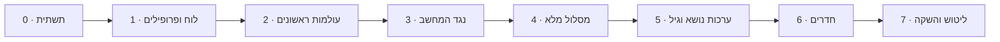

# מפת דרכים – אפליקציית לימוד שחמט

הבנייה מתחלקת לשבעה שלבים. כל שלב מסתיים בגרסה עובדת שאפשר לשחק בה בבית, ולכל שלב יש תנאי סיום ברור. הסדר בנוי כך שכבר בשלב 2 הילדים יכולים להתחיל ללמוד.

---

## שלב 0 – תשתית

- [x] מאגר ציבורי ב-GitHub עם רישיון GPL-3
- [x] פרויקט Vite + TypeScript + Preact
- [x] פריסה אוטומטית ל-GitHub Pages דרך GitHub Actions
- [x] מעטפת PWA: manifest, אייקונים, Service Worker
- [x] ממשק RTL בסיסי וגופן עברי

**תנאי סיום**: דף "שלום" נפתח מהטלפון, מותקן למסך הבית ועובד במצב טיסה.

## שלב 1 – לוח ופרופילים

- [ ] שכבת אחסון ב-IndexedDB עם גרסת סכמה
- [ ] מסכי בחירת פרופיל ויצירת פרופיל (שם, אווטאר, קבוצת גיל, מין)
- [ ] רכיב לוח ב-SVG: הקשה וגרירה, הדגשת מסעים חוקיים, אנימציית מסע
- [ ] חיבור chess.js: מסעים חוקיים, שח, מט, פט, הכתרה
- [ ] משחק שני שחקנים על אותו טלפון, עם סיבוב לוח

**תנאי סיום**: שני פרופילים משחקים משחק שלם ותקין על טלפון אחד, והפרופילים נשמרים אחרי סגירת האפליקציה.

## שלב 2 – עולמות ראשונים

- [ ] פורמט JSON לעולמות ולתחנות, ובודק מטרות (`collectStars`, `captureAll`)
- [ ] מסך מפת המסלול: תחנות נעולות ופתוחות, כוכבים
- [ ] מסכי שיעור ומשחקון, עם רמז ומשוב
- [ ] עולם 1: הלוח
- [ ] עולם 2: הכלים, עולם קטן לכל כלי
- [ ] טקסטים לשלוש קבוצות הגיל
- [ ] התקדמות נפרדת לכל פרופיל

**תנאי סיום**: ילד בגיל 6 מסיים לבד את עולם הצריח, ומבוגר מסיים את עולם 2 בפחות מ-10 דקות.

## שלב 3 – נגד המחשב

- [ ] ממשק `Engine` ו-Web Worker
- [ ] `KidEngine` לרמות 1–2
- [ ] Stockfish WASM לרמות 3–8, נטען רק כשצריך
- [ ] בחירת רמה, הצעה לעלות או לרדת ברמה
- [ ] מצב הורה-ילד: הורדת כלים לשחקן החזק
- [ ] מסך סיכום: מסע טוב ומסע לשיפור

**תנאי סיום**: ילד בגיל 6 מנצח את רמה 1 לפחות בחצי מהמשחקים, ורמה 8 מאתגרת שחקן מבוגר מתחיל.

## שלב 4 – מסלול מלא

- [ ] עולם 3: הכאה והגנה, ערך הכלים
- [ ] עולם 4: שח ויציאה משח
- [ ] עולם 5: מט במסע אחד ומטים בסיסיים
- [ ] עולם 6: הצרחה, הכתרה, הכאה דרך הילוכו, פט
- [ ] עולם 7: מזלג, סיכה, התקפה כפולה
- [ ] עולם 8: עקרונות פתיחה ומשחקים מודרכים
- [ ] חידות ממאגר Lichess, מסוננות לפי נושא ורמה
- [ ] חזרה מרווחת וחידה יומית
- [ ] מבחן כניסה למבוגרים

**תנאי סיום**: אפשר להתקדם מאפס ועד משחק מלא בלי עזרה חיצונית.

## שלב 5 – ערכות נושא והתאמה לגיל

- [ ] מבנה ערכת נושא: צבעים, סט כלים, רקע, צלילים, אווטארים
- [ ] 3 ערכות ראשונות, למשל חלל, יער קסום ועיצוב נקי
- [ ] הצעת ערכה לפי גיל ומין, ובחירה חופשית בכל רגע
- [ ] הקראה בעברית לגיל 5–7, עם גיבוי כשאין קול עברי במכשיר
- [ ] צלילים ואנימציות פרס
- [ ] PIN אופציונלי לפרופיל

**תנאי סיום**: כל ילד בבית בוחר ערכה ומרגיש שהאפליקציה "שלו".

## שלב 6 – חדרים

- [ ] ממשק `Transport` ומימוש Firebase Realtime Database
- [ ] יצירת חדר: קוד של 5 תווים ו-QR
- [ ] הצטרפות בקוד או בסריקה
- [ ] סנכרון מסעים, אימות בשני המכשירים, חזרה לחדר אחרי ניתוק
- [ ] סמלי רגש מוכנים מראש, בלי צ'אט חופשי
- [ ] מחיקת חדר בסיום או אחרי חוסר פעילות
- [ ] כללי אבטחה ב-Firebase

**תנאי סיום**: שני טלפונים ברשתות שונות (Wi-Fi וסלולר) משחקים משחק שלם, כולל ניתוק וחזרה באמצע.

## שלב 7 – ליטוש והשקה

- [ ] גיבוי ושחזור של הפרופילים לקובץ
- [ ] בדיקת נגישות: גודל מגע, ניגודיות, הקטנת אנימציות
- [ ] בדיקות על אנדרואיד ועל אייפון (Safari)
- [ ] מסך אודות ופרטיות
- [ ] בטא משפחתית: שבועיים של שימוש ותיקונים
- [ ] פרסום הקישור

**תנאי סיום**: האפליקציה עובדת יציב שבועיים בבית, ומוכנה לשיתוף ציבורי.

---

## אחרי ההשקה – רעיונות

- עולמות נוספים: סיומים, אסטרטגיה, פתיחות מוכרות
- אתגרים משפחתיים: מי צובר הכי הרבה כוכבים השבוע
- דירוג אישי לכל פרופיל
- ניתוח משחק מלא עם הערות פשוטות
- אנגלית כשפה נוספת
