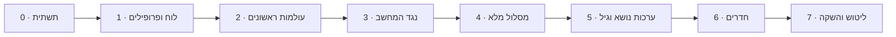

# מפת דרכים – אפליקציית לימוד שחמט

הבנייה מתחלקת לשבעה שלבים. כל שלב מסתיים בגרסה עובדת שאפשר לשחק בה בבית, ולכל שלב יש תנאי סיום ברור. הסדר בנוי כך שכבר בשלב 2 הילדים יכולים להתחיל ללמוד.

---

## שלב 0 – תשתית

- [x] מאגר ציבורי ב-GitHub עם רישיון GPL-3
- [x] פרויקט Vite + TypeScript + Preact
- [x] פריסה אוטומטית ל-GitHub Pages דרך GitHub Actions
- [x] מעטפת PWA: manifest, אייקונים, Service Worker
- [x] ממשק RTL בסיסי וגופן עברי

**תנאי סיום**: דף "שלום" נפתח מהטלפון, מותקן למסך הבית ועובד במצב טיסה.

## שלב 1 – לוח ופרופילים

- [x] שכבת אחסון ב-IndexedDB עם גרסת סכמה
- [x] מסכי בחירת פרופיל ויצירת פרופיל (שם, אווטאר, קבוצת גיל, מין)
- [x] רכיב לוח ב-SVG: הקשה וגרירה, הדגשת מסעים חוקיים, אנימציית מסע
- [x] חיבור chess.js: מסעים חוקיים, שח, מט, פט, הכתרה
- [x] משחק שני שחקנים על אותו טלפון, עם סיבוב לוח
- [x] שמירת משחק פתוח והמשך אחרי סגירת האפליקציה

**תנאי סיום**: שני פרופילים משחקים משחק שלם ותקין על טלפון אחד, והפרופילים נשמרים אחרי סגירת האפליקציה.

## שלב 2 – עולמות ראשונים

- [x] פורמט JSON לעולמות ולתחנות, בדיקת תקינות בזמן טעינה, ובודק מטרות (`collectStars`, `captureAll`, `reachSquare`, `promote`, `tapSquares`)
- [x] מסך מפת המסלול: שביל מתפתל, תחנות נעולות ופתוחות, כוכבים, "אתה כאן"
- [x] מסכי שיעור (הדגמה מונפשת ואז תרגול) ומשחקון, עם רמז, משוב על מסע לא חוקי ומסך סיום עם חגיגה
- [x] עולם 1: הלוח (5 תחנות)
- [x] עולם 2: הכלים, עולם קטן לכל כלי (צריח, רץ, מלכה, מלך, פרש, רגלי – 21 תחנות), עם דמות לכל כלי
- [x] טקסטים לשלוש קבוצות הגיל, עם פנייה לפי מין
- [x] התקדמות נפרדת לכל פרופיל

**תנאי סיום**: ילד בגיל 6 מסיים לבד את עולם הצריח, ומבוגר מסיים את עולם 2 בפחות מ-10 דקות.

**מצב**: הושלם ונפרס. נבדק אוטומטית בגודל טלפון (`tests/e2e/phase2.cjs`), וכל 26 התחנות נפתרות בבדיקת התוכן (`tests/content/check.ts`). את תנאי הסיום עצמו צריך לבדוק בבית: ילד אמיתי על עולם הצריח, ומבוגר עם שעון על עולם 2 (ההערכה: כ-6 דקות).

## שלב 3 – נגד המחשב

- [x] ממשק `Engine` ו-Web Worker
- [x] `KidEngine` לרמות 1–2
- [x] Stockfish WASM לרמות 3–8, נטען רק כשצריך
- [x] בחירת רמה, הצעה לעלות או לרדת ברמה
- [x] מצב הורה-ילד: הורדת כלים לשחקן החזק
- [x] מסך סיכום: מסע טוב ומסע לשיפור

**תנאי סיום**: ילד בגיל 6 מנצח את רמה 1 לפחות בחצי מהמשחקים, ורמה 8 מאתגרת שחקן מבוגר מתחיל.

**מצב**: הושלם ונפרס.

נבדק אוטומטית:
- סימולציה בטרמינל (`bun tests/engine/sim.ts`, 100 משחקים לכל זוג): "מתחיל" מדומה מנצח את רמה 1 ב-71% מהמשחקים (28% תיקו), ורמה 2 מנצחת את רמה 1 ב-99%. עם `ladder`: כל רמה מ-3 עד 8 מנצחת את הרמה שמתחתיה ב-55%–75% מהמשחקים, כך שהרמות מדורגות.
- בדפדפן בגודל טלפון (`tests/e2e/phase3.cjs`): הגדרת משחק, רמה 1 עם seed, תשובות המחשב, ביטול מסע, שמירה אחרי רענון, משחק שלם מעמדה עם הורדת כלים, הצעה לעלות רמה אחרי 3 ניצחונות, מסך סיכום, Stockfish ברמה 3 נטען ועונה, ומעבר לרמה 2 כש-Stockfish לא נטען. גם `phase1.cjs` ו-`phase2.cjs` עוברות.

צריך לבדוק בבית:
- ילד בגיל 6 שסיים את עולם הכלים משחק כמה משחקים מול רמה 1 (שווה לנסות גם עם "להראות לאן אפשר לזוז" ועם ביטול מסע). המטרה: ניצחון לפחות בחצי.
- מבוגר מתחיל משחק מול רמה 8. המטרה: משחק קשה, שלפעמים אפשר לנצח. אם קל מדי או קשה מדי, משנים את השורה של רמה 8 ב-`src/engine/levels.ts`.
- שהסיכום ברור לכל קבוצת גיל, ושהמנוע עובד בלי רשת אחרי משחק אחד ברמה 3 ומעלה.

## שלב 4 – מסלול מלא

- [x] מטרות חדשות על עמדות אמיתיות (chess.js): `mateIn`, `escapeCheck`, `defend`, `findBestMove` (כולל רצף מתוסרט), `playOut` (מול מלך בודד או מחשב, עם מאמן)
- [x] עולם 3: הכאה והגנה, ערך הכלים (8 תחנות)
- [x] עולם 4: שח ויציאה משח (7 תחנות)
- [x] עולם 5: מט במסע אחד ומטים בסיסיים (9 תחנות)
- [x] עולם 6: הצרחה, הכתרה, הכאה דרך הילוכו, פט (7 תחנות)
- [x] עולם 7: מזלג, סיכה, התקפה כפולה (6 תחנות)
- [x] עולם 8: עקרונות פתיחה ומשחקים מודרכים (8 תחנות)
- [x] חידות ממאגר Lichess, מסוננות לפי נושא ורמה (סקריפט + 326 חידות מדגימה של המאגר)
- [x] חזרה מרווחת וחידה יומית
- [x] מבחן כניסה למבוגרים
- [x] מפה עם 8 חלקים מתקפלים

**תנאי סיום**: אפשר להתקדם מאפס ועד משחק מלא בלי עזרה חיצונית.

**מצב**: הושלם ונפרס. 71 תחנות בשמונה חלקים.

נבדק אוטומטית:
- `bun tests/content/check.ts`: כל 71 התחנות תקינות ונפתרות (כולל מט בשניים בלי הגנה, וכל משחקי הסיום מול המלך הבודד – שחקן הבדיקה מנצח), שאלות מבחן הכניסה תקינות, וכל 326 החידות נפתרות לפי הפתרון שלהן. התשובות ב-`findBestMove` נבדקו גם מול Stockfish.
- בדפדפן בגודל טלפון (`tests/e2e/phase4.cjs`): מבחן כניסה של מבוגר (7/8 → חלקים 1–6 "עברתי", רמה 5 מוצעת), מפה עם 8 חלקים, מסע לא חוקי בגלל שח ("המלך שלך בשח! קודם צריך להציל אותו"), יציאה משח בדרך הלא נכונה ובחסימה, שלוש הדרכים, "שח אבל לא מט", מט בשניים עם הגנה של היריב, סולם צריחים מול המלך הבודד, הצלת כלי בשלושה סבבים, מזלג עם תשובה מתוסרטת, פתיחה מודרכת מול רמה 1 (הערת מאמן, ביטול מסע), חידה יומית, חידה עם טעות שנכנסת לחזרה, חזרה אחרי זריעת תאריכים (החידה עוברת למרווח 3 ימים), ילד בלי הצעת מבחן, וצילומי מצב כהה. גם `phase1.cjs`, ‏`phase2.cjs` (עם עדכון: אחרי הרגלי ממשיכים לעולם 3) ו-`phase3.cjs` עוברות.

צריך לבדוק בבית:
- ילד בגיל 6–8 שעובר לבד את עולם 4 (שח), ואת "מלכה ומלך נגד מלך" בעולם 5. אם קשה מדי – להוסיף תחנת ביניים או להתחיל מעמדה קרובה יותר למט.
- מבוגר שעושה את מבחן הכניסה, ואחר כך משחק מול הרמה המוצעת: האם היא מתאימה?
- משחק מודרך שלם (עולם 8) עם ילד: האם ההערות מובנות ולא מציפות?
- שהחידות מתאימות בקושי. כדאי להריץ את `scripts/puzzles.ts` על המאגר המלא (ההוראות בראש הקובץ), כדי שיהיו 80 חידות בכל נושא במקום הדגימה.

## שלב 5 – ערכות נושא והתאמה לגיל

- [ ] מבנה ערכת נושא: צבעים, סט כלים, רקע, צלילים, אווטארים
- [ ] 3 ערכות ראשונות, למשל חלל, יער קסום ועיצוב נקי
- [ ] הצעת ערכה לפי גיל ומין, ובחירה חופשית בכל רגע
- [ ] הקראה בעברית לגיל 5–7, עם גיבוי כשאין קול עברי במכשיר
- [ ] צלילים ואנימציות פרס
- [ ] PIN אופציונלי לפרופיל

**תנאי סיום**: כל ילד בבית בוחר ערכה ומרגיש שהאפליקציה "שלו".

## שלב 6 – חדרים

- [ ] ממשק `Transport` ומימוש Firebase Realtime Database
- [ ] יצירת חדר: קוד של 5 תווים ו-QR
- [ ] הצטרפות בקוד או בסריקה
- [ ] סנכרון מסעים, אימות בשני המכשירים, חזרה לחדר אחרי ניתוק
- [ ] סמלי רגש מוכנים מראש, בלי צ'אט חופשי
- [ ] מחיקת חדר בסיום או אחרי חוסר פעילות
- [ ] כללי אבטחה ב-Firebase

**תנאי סיום**: שני טלפונים ברשתות שונות (Wi-Fi וסלולר) משחקים משחק שלם, כולל ניתוק וחזרה באמצע.

## שלב 7 – ליטוש והשקה

- [ ] גיבוי ושחזור של הפרופילים לקובץ
- [ ] בדיקת נגישות: גודל מגע, ניגודיות, הקטנת אנימציות
- [ ] בדיקות על אנדרואיד ועל אייפון (Safari)
- [ ] מסך אודות ופרטיות
- [ ] בטא משפחתית: שבועיים של שימוש ותיקונים
- [ ] פרסום הקישור

**תנאי סיום**: האפליקציה עובדת יציב שבועיים בבית, ומוכנה לשיתוף ציבורי.

---

## אחרי ההשקה – רעיונות

- עולמות נוספים: סיומים, אסטרטגיה, פתיחות מוכרות
- אתגרים משפחתיים: מי צובר הכי הרבה כוכבים השבוע
- דירוג אישי לכל פרופיל
- ניתוח משחק מלא עם הערות פשוטות
- אנגלית כשפה נוספת
