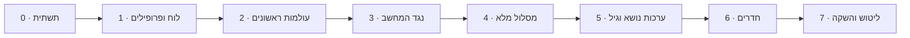

# מפת דרכים – אפליקציית לימוד שחמט

הבנייה מתחלקת לשבעה שלבים. כל שלב מסתיים בגרסה עובדת שאפשר לשחק בה בבית, ולכל שלב יש תנאי סיום ברור. הסדר בנוי כך שכבר בשלב 2 הילדים יכולים להתחיל ללמוד.

---

## שלב 0 – תשתית

- [x] מאגר ציבורי ב-GitHub עם רישיון GPL-3
- [x] פרויקט Vite + TypeScript + Preact
- [x] פריסה אוטומטית ל-GitHub Pages דרך GitHub Actions
- [x] מעטפת PWA: manifest, אייקונים, Service Worker
- [x] ממשק RTL בסיסי וגופן עברי

**תנאי סיום**: דף "שלום" נפתח מהטלפון, מותקן למסך הבית ועובד במצב טיסה.

## שלב 1 – לוח ופרופילים

- [x] שכבת אחסון ב-IndexedDB עם גרסת סכמה
- [x] מסכי בחירת פרופיל ויצירת פרופיל (שם, אווטאר, קבוצת גיל, מין)
- [x] רכיב לוח ב-SVG: הקשה וגרירה, הדגשת מסעים חוקיים, אנימציית מסע
- [x] חיבור chess.js: מסעים חוקיים, שח, מט, פט, הכתרה
- [x] משחק שני שחקנים על אותו טלפון, עם סיבוב לוח
- [x] שמירת משחק פתוח והמשך אחרי סגירת האפליקציה

**תנאי סיום**: שני פרופילים משחקים משחק שלם ותקין על טלפון אחד, והפרופילים נשמרים אחרי סגירת האפליקציה.

## שלב 2 – עולמות ראשונים

- [x] פורמט JSON לעולמות ולתחנות, בדיקת תקינות בזמן טעינה, ובודק מטרות (`collectStars`, `captureAll`, `reachSquare`, `promote`, `tapSquares`)
- [x] מסך מפת המסלול: שביל מתפתל, תחנות נעולות ופתוחות, כוכבים, "אתה כאן"
- [x] מסכי שיעור (הדגמה מונפשת ואז תרגול) ומשחקון, עם רמז, משוב על מסע לא חוקי ומסך סיום עם חגיגה
- [x] עולם 1: הלוח (5 תחנות)
- [x] עולם 2: הכלים, עולם קטן לכל כלי (צריח, רץ, מלכה, מלך, פרש, רגלי – 21 תחנות), עם דמות לכל כלי
- [x] טקסטים לשלוש קבוצות הגיל, עם פנייה לפי מין
- [x] התקדמות נפרדת לכל פרופיל

**תנאי סיום**: ילד בגיל 6 מסיים לבד את עולם הצריח, ומבוגר מסיים את עולם 2 בפחות מ-10 דקות.

**מצב**: הושלם ונפרס. נבדק אוטומטית בגודל טלפון (`tests/e2e/phase2.cjs`), וכל 26 התחנות נפתרות בבדיקת התוכן (`tests/content/check.ts`). את תנאי הסיום עצמו צריך לבדוק בבית: ילד אמיתי על עולם הצריח, ומבוגר עם שעון על עולם 2 (ההערכה: כ-6 דקות).

## שלב 3 – נגד המחשב

- [x] ממשק `Engine` ו-Web Worker
- [x] `KidEngine` לרמות 1–2
- [x] Stockfish WASM לרמות 3–8, נטען רק כשצריך
- [x] בחירת רמה, הצעה לעלות או לרדת ברמה
- [x] מצב הורה-ילד: הורדת כלים לשחקן החזק
- [x] מסך סיכום: מסע טוב ומסע לשיפור

**תנאי סיום**: ילד בגיל 6 מנצח את רמה 1 לפחות בחצי מהמשחקים, ורמה 8 מאתגרת שחקן מבוגר מתחיל.

**מצב**: הושלם ונפרס.

נבדק אוטומטית:
- סימולציה בטרמינל (`bun tests/engine/sim.ts`, 100 משחקים לכל זוג): "מתחיל" מדומה מנצח את רמה 1 ב-71% מהמשחקים (28% תיקו), ורמה 2 מנצחת את רמה 1 ב-99%. עם `ladder`: כל רמה מ-3 עד 8 מנצחת את הרמה שמתחתיה ב-55%–75% מהמשחקים, כך שהרמות מדורגות.
- בדפדפן בגודל טלפון (`tests/e2e/phase3.cjs`): הגדרת משחק, רמה 1 עם seed, תשובות המחשב, ביטול מסע, שמירה אחרי רענון, משחק שלם מעמדה עם הורדת כלים, הצעה לעלות רמה אחרי 3 ניצחונות, מסך סיכום, Stockfish ברמה 3 נטען ועונה, ומעבר לרמה 2 כש-Stockfish לא נטען. גם `phase1.cjs` ו-`phase2.cjs` עוברות.

צריך לבדוק בבית:
- ילד בגיל 6 שסיים את עולם הכלים משחק כמה משחקים מול רמה 1 (שווה לנסות גם עם "להראות לאן אפשר לזוז" ועם ביטול מסע). המטרה: ניצחון לפחות בחצי.
- מבוגר מתחיל משחק מול רמה 8. המטרה: משחק קשה, שלפעמים אפשר לנצח. אם קל מדי או קשה מדי, משנים את השורה של רמה 8 ב-`src/engine/levels.ts`.
- שהסיכום ברור לכל קבוצת גיל, ושהמנוע עובד בלי רשת אחרי משחק אחד ברמה 3 ומעלה.

## שלב 4 – מסלול מלא

- [x] מטרות חדשות על עמדות אמיתיות (chess.js): `mateIn`, `escapeCheck`, `defend`, `findBestMove` (כולל רצף מתוסרט), `playOut` (מול מלך בודד או מחשב, עם מאמן)
- [x] עולם 3: הכאה והגנה, ערך הכלים (8 תחנות)
- [x] עולם 4: שח ויציאה משח (7 תחנות)
- [x] עולם 5: מט במסע אחד ומטים בסיסיים (9 תחנות)
- [x] עולם 6: הצרחה, הכתרה, הכאה דרך הילוכו, פט (7 תחנות)
- [x] עולם 7: מזלג, סיכה, התקפה כפולה (6 תחנות)
- [x] עולם 8: עקרונות פתיחה ומשחקים מודרכים (8 תחנות)
- [x] חידות ממאגר Lichess, מסוננות לפי נושא ורמה (סקריפט + 326 חידות מדגימה של המאגר)
- [x] חזרה מרווחת וחידה יומית
- [x] מבחן כניסה למבוגרים
- [x] מפה עם 8 חלקים מתקפלים

**תנאי סיום**: אפשר להתקדם מאפס ועד משחק מלא בלי עזרה חיצונית.

**מצב**: הושלם ונפרס. 71 תחנות בשמונה חלקים.

נבדק אוטומטית:
- `bun tests/content/check.ts`: כל 71 התחנות תקינות ונפתרות (כולל מט בשניים בלי הגנה, וכל משחקי הסיום מול המלך הבודד – שחקן הבדיקה מנצח), שאלות מבחן הכניסה תקינות, וכל 326 החידות נפתרות לפי הפתרון שלהן. התשובות ב-`findBestMove` נבדקו גם מול Stockfish.
- בדפדפן בגודל טלפון (`tests/e2e/phase4.cjs`): מבחן כניסה של מבוגר (7/8 → חלקים 1–6 "עברתי", רמה 5 מוצעת), מפה עם 8 חלקים, מסע לא חוקי בגלל שח ("המלך שלך בשח! קודם צריך להציל אותו"), יציאה משח בדרך הלא נכונה ובחסימה, שלוש הדרכים, "שח אבל לא מט", מט בשניים עם הגנה של היריב, סולם צריחים מול המלך הבודד, הצלת כלי בשלושה סבבים, מזלג עם תשובה מתוסרטת, פתיחה מודרכת מול רמה 1 (הערת מאמן, ביטול מסע), חידה יומית, חידה עם טעות שנכנסת לחזרה, חזרה אחרי זריעת תאריכים (החידה עוברת למרווח 3 ימים), ילד בלי הצעת מבחן, וצילומי מצב כהה. גם `phase1.cjs`, ‏`phase2.cjs` (עם עדכון: אחרי הרגלי ממשיכים לעולם 3) ו-`phase3.cjs` עוברות.

צריך לבדוק בבית:
- ילד בגיל 6–8 שעובר לבד את עולם 4 (שח), ואת "מלכה ומלך נגד מלך" בעולם 5. אם קשה מדי – להוסיף תחנת ביניים או להתחיל מעמדה קרובה יותר למט.
- מבוגר שעושה את מבחן הכניסה, ואחר כך משחק מול הרמה המוצעת: האם היא מתאימה?
- משחק מודרך שלם (עולם 8) עם ילד: האם ההערות מובנות ולא מציפות?
- שהחידות מתאימות בקושי. כדאי להריץ את `scripts/puzzles.ts` על המאגר המלא (ההוראות בראש הקובץ), כדי שיהיו 80 חידות בכל נושא במקום הדגימה.

## שלב 5 – ערכות נושא והתאמה לגיל

- [x] מבנה ערכת נושא: צבעים, סט כלים, רקע, צלילים, אווטארים (כל ערכה נטענת בעצלות, החלפה בלי רענון)
- [x] סט כלים ב-SVG ("cburnett", ‏GPLv2+) בכל מקום: לוח, גרירה, הכתרה, כלים שנאכלו, דמויות ומפה
- [x] 3 ערכות ראשונות: נקי ✨, חלל 🚀, יער קסום 🌳 – כל אחת במצב בהיר וכהה
- [x] הצעת ערכה לפי גיל ומין, ובחירה חופשית בכל רגע (עורך הפרופיל, 🎨 בבית, הגדרות)
- [x] הקראה בעברית לגיל 5–7, עם גיבוי כשאין קול עברי במכשיר
- [x] צלילים (Web Audio, בלי קבצים) ואנימציות פרס לפי ערכה
- [x] PIN אופציונלי לפרופיל, עם איפוס בשאלה להורה
- [x] מסך הגדרות לפרופיל (הגדרת רמזים נדחתה – ראו ARCHITECTURE)

**תנאי סיום**: כל ילד בבית בוחר ערכה ומרגיש שהאפליקציה "שלו".

**מצב**: הושלם ונפרס. הטעינה הראשונה ירדה מ-283KB ל-259KB, כי מסכים שלא צריך בכניסה נטענים עכשיו בעצלות.

נבדק אוטומטית:
- `bun tests/themes/check.ts`: לכל שלוש הערכות, בהיר וכהה – כל המשתנים מוגדרים, טקסט בניגודיות 4.5:1 לפחות, משבצות, קואורדינטות וכלים בולטים. גם ניקוי הטקסט להקראה (אימוג'י, סמלים, "e4" → "אִי 4") ושאלת ההורה.
- בדפדפן בגודל טלפון (`tests/e2e/phase5.cjs`): הצעת ערכה לפי גיל ומין (בן 5–7 → חלל, בת → יער, ‎13+‎ → נקי) עם תצוגה חיה ואווטארים של הערכה; החלפת ערכה מהבית – צבעי הלוח והכלים משתנים בלי רענון ונשמרים אחרי רענון; לוח עם כלי SVG (מסע, אכילה והכלי בפס השחקן, הכתרה לפרש עם בורר של כלי SVG); צלילי מסע ואכילה, ושקט אחרי כיבוי הצלילים; בלי קול עברי – אין 🔊 והסבר להורה מוצג פעם אחת; עם קול עברי מדומה – ההסבר והמשימה מוקראים ב-`he-IL` בטקסט נקי, 🔊 עובד, וההקראה נעצרת ביציאה מהמסך; מבוגר בלי הקראה אוטומטית; PIN – הגדרה עם אישור, שמירה כ-hash בלבד, PIN שגוי ונכון (גם אחרי רענון), PIN לפני עריכה, ואיפוס בשאלה להורה (תשובה שגויה ואז נכונה); צילומי מסך של שלוש הערכות (בית, מפה, תחנה) בבהיר ובכהה. גם `phase1.cjs` עד `phase4.cjs` ובדיקת התוכן (71 תחנות, 326 חידות) עוברות.

צריך לבדוק בבית:
- כל ילד בוחר ערכה בעצמו: האם ההצעה הראשונה מתאימה, והאם הם מחליפים ומרגישים שזה "שלהם"? אם חסרה ערכה שהם רוצים – מוסיפים לפי "איך מוסיפים ערכה" ב-ARCHITECTURE.
- ילד בן 6 עם הקראה, בטלפון אמיתי – אנדרואיד וגם אייפון: יש קול עברי? ההקראה ברורה, לא מהירה מדי, ושמות המשבצות ("אִי 4") נשמעים טבעיים? אם אין קול – האם ההסבר להורה עזר להתקין אותו?
- הצלילים בטלפון: נעימים ולא חזקים מדי בכל ערכה, ובאייפון במתג שקט – שקט.
- ה-PIN: ילד מצליח להיכנס לבד, אח לא נכנס בטעות, ושאלת ההורה קשה מספיק לילדים בבית.
- שהכלים ברורים בגודל הלוח בטלפון בכל ערכה, גם במצב כהה.

## שלב 6 – חדרים

- [x] ממשק `Transport` ומימוש Firebase Realtime Database (REST + ‏Server-Sent Events, בלי SDK), ומימוש מדומה בין לשוניות (`?transport=local`)
- [x] יצירת חדר: קוד של 5 תווים בלי תווים מבלבלים, ו-QR (מימוש משלנו)
- [x] הצטרפות בקוד (מקלדת גדולה) או בקישור/סריקה (`?room=CODE`, אחרי בחירת פרופיל ו-PIN)
- [x] סנכרון מסעים, אימות בשני המכשירים (ותיקון כשמגיע מסע לא חוקי), "מתחבר מחדש…" וחזרה לחדר אחרי ניתוק, רענון או סגירה
- [x] סמלי רגש מוכנים מראש (👏 😮 😅 🤝 ❤️ 🔥), בלי צ'אט חופשי
- [x] הצעת תיקו, כניעה, משחק חוזר עם החלפת צבעים, מצב הורה-ילד בחדר
- [x] מחיקת חדר כשכולם יוצאים, וניקוי מתוזמן של חדרים שלא השתנו שעתיים (GitHub Action)
- [x] כללי אבטחה ב-Firebase (`firebase/database.rules.json`) והוראות הקמה (`docs/FIREBASE.md`)

**תנאי סיום**: שני טלפונים ברשתות שונות (Wi-Fi וסלולר) משחקים משחק שלם, כולל ניתוק וחזרה באמצע.

**מצב**: הקוד הושלם ונפרס. הטעינה הראשונה כ-260KB (היה 259KB): כל קוד החדר הוא chunk נפרד. החיבור ל-Firebase האמיתי ממתין לכתובת המסד (`src/net/config.ts`) – עד אז הכרטיס בבית מסביר שהחדרים עוד לא מוכנים.

נבדק אוטומטית:
- `tests/net/check.ts` (102 בדיקות): קוד החדר (5 תווים, 24 תווים בלי 0/O/1/I/L/2/Z/5/S/6/8/B), הודעות ומסמכים לא תקינים נזרקים, הכללים (יצירה, הצטרפות, מסע אחד בכל פעם, שני מכשירים על אותו מסע – אחד מצליח, כניעה, משחק חוזר, מחיקה), ההודעות שעולות משינויים, ופענוח ה-QR עם OpenCV.
- בדפדפן בגודל טלפון (`tests/e2e/phase6.cjs`), שני דפים עם `?transport=local`: פתיחת חדר (קוד ב-LTR, ‏QR שמתפענח לקישור), הצטרפות בקוד (אחרי קוד שגוי) ובקישור `?room=`, משחק עד מט (המסעים בשני הדפים, כל לוח מהצד שלו), סמל רגש ליד השולח, מסע לא חוקי שנכתב ישר לחדר – שני הטלפונים דוחים ומתקנים, הודעה לא תקינה נזרקת ו-ply+2 נדחה, סגירת דף ("לא מחוברת כרגע") וחזרה עם סנכרון מלא, רענון באמצע (בבית גם "המשך המשחק" המקומי וגם "חזרה לחדר"), בלי רשת באמצע ("אין אינטרנט", הלוח מחכה) והמשך, משחק חוזר עם החלפת צבעים, הצעת תיקו שנדחתה, כניעה, יציאה (הסטטיסטיקה נספרת פעם אחת, האחרון שיוצא מוחק את החדר), מצב הורה-ילד, אותו פרופיל בשתי לשוניות ששולח שני מסעים בבת אחת (אחד נכתב, כל הלוחות מסכימים), שחקן שלישי מקבל "כבר יש שני שחקנים", ו"צריך אינטרנט כדי לשחק בחדר" בלי רשת (והמפה עדיין נפתחת). צילום במצב כהה בערכת יער.
- מימוש ה-Firebase עצמו (REST + ‏SSE), מול שרת מדומה שמדבר באותו פרוטוקול ובודק עם אותם כללים (`tests/net/mock-firebase.ts`), בשני הקשרים נפרדים: יצירה, הצטרפות בקישור מטלפון חדש, מסעים, נפילת השרת ל-7 שניות ("מתחבר מחדש…" ואז חזרה), כניעה, יציאה ומחיקה. גם סקריפט הניקוי מוחק רק חדרים ישנים.
- `phase1.cjs` עד `phase5.cjs`, בדיקת התוכן (71 תחנות, 326 חידות) ובדיקת הערכות (כולל צבעי ה-QR) עוברות.

צריך לבדוק בבית (אחרי שכתובת המסד נכנסה לקוד, וכללי האבטחה פורסמו):
- שני טלפונים אמיתיים, אחד ב-Wi-Fi ואחד בסלולר (עדיף אנדרואיד אחד ואייפון אחד): משחק שלם עד הסוף.
- באמצע המשחק: מצב טיסה לחצי דקה בטלפון אחד – "מתחבר מחדש…", ואחרי כיבוי – הלוח מסונכרן והמשחק ממשיך. גם: להעביר את האפליקציה לרקע לכמה דקות ולחזור, ולסגור אותה לגמרי ולפתוח שוב ("חזרה לחדר").
- סריקת ה-QR במצלמה הרגילה של הטלפון (אנדרואיד ואייפון) – הקישור נפתח ומגיע ישר להצטרפות. גם "שיתוף הקישור" בוואטסאפ.
- ב-Firebase, בלשונית Data: החדר מופיע בזמן המשחק ונעלם אחרי ששני השחקנים יצאו. אחרי הגדרת הסוד – הרצה ידנית של "Clean up old rooms" עוברת.
- ילד בן 6–8 מול סבא מרחוק: האם הוא מבין של מי התור, ואם סמלי הרגש כיפיים ולא מסיחים.

## שלב 7 – ליטוש והשקה

- [x] גיבוי ושחזור של כל המשפחה לקובץ (שיתוף או הורדה, תצוגה מקדימה, "להוסיף" או "להחליף הכול"), ותזכורת חד-פעמית אחרי 20 תחנות
- [x] בדיקת נגישות: גודל מגע, ניגודיות של טקסט אמיתי בכל הערכות, שמות לכפתורים, פוקוס גלוי, לוח במקלדת, הקטנת אנימציות
- [ ] בדיקות על אנדרואיד ועל אייפון (Safari) – הרשימה ב-[DEVICE-CHECKS.md](DEVICE-CHECKS.md), בבית
- [x] מסך אודות ופרטיות (גרסה, פרטיות, תודות ורישיונות, מחיקת כל הנתונים)
- [ ] בטא משפחתית: שבועיים של שימוש ותיקונים (דיווח בעיה ויומן שגיאות מקומי – מוכנים; הטבלה למטה)
- [x] פרסום הקישור: README לקהל רחב עם צילומי מסך והוראות התקנה, תמונת שיתוף ותגיות `og:` לוואטסאפ, מניפסט
- [x] כתובת Firebase בקוד (`src/net/config.ts`) – החדרים פעילים באתר

**תנאי סיום**: האפליקציה עובדת יציב שבועיים בבית, ומוכנה לשיתוף ציבורי.

**מצב**: הקוד הושלם ונפרס (גרסה `0.9.0`). נשארו הבדיקות בטלפונים ושבועיים של בטא משפחתית. בסוף הבטא, אם הכול יציב: מעלים את הגרסה ל-`1.0.0` ב-`package.json` ומשתפים את הקישור.

הטעינה הראשונה: כ-269KB (‏JS ‏147.1KB + ‏CSS ‏37.2KB + התוכן 84.4KB; ‏77KB ב-gzip), לעומת 260KB לפני השלב. הגיבוי (‏10.4KB) ומסך האודות (‏9.6KB) נטענים בעצלות. הגופן (‏33KB) עבר מ-Google Fonts לאתר עצמו.

נבדק אוטומטית:
- `tests/storage/check.ts` (49 בדיקות): גיבוי תקין עובר ונוקה (שדות לא מוכרים נזרקים, שדות חסרים מקבלים ברירת מחדל), 25 סוגי קבצים פגומים נדחים מהסיבה הנכונה (לא JSON, נחתך, פורמט אחר, גרסה עתידית, פרופיל כפול, גיל לא מוכר, ספרות PIN במקום hash, התקדמות של פרופיל שלא קיים, 5 כוכבים, קובץ ענק…), ותוכנית השחזור: "להוסיף" לא מוחק כלום ומכבד את הבחירה לכל פרופיל, "להחליף" מנקה ואז כותב, ומשחק פתוח, חדר ופרופיל אחרון של פרופיל שנעלם – נמחקים.
- בדפדפן בגודל טלפון (`tests/e2e/phase7.cjs`): תזכורת הגיבוי אחרי 20 תחנות ו"לא עכשיו" שנשמר; קובץ גיבוי שמורד ותקין (פורמט, גרסה, תאריך, כל הפרופילים, ההתקדמות וההגדרות, ה-PIN כ-hash בלבד, בלי משחק פתוח וחדר); בדפדפן נקי – שישה קבצים פגומים נדחים ושום דבר לא נכתב, תצוגה מקדימה, ושחזור שמחזיר פרופילים, כוכבים, ערכה, הגדרות ו-PIN (PIN שגוי נדחה); "להוסיף" עם פרופיל חדש, התנגשות שנלקחת מהגיבוי והתנגשות שנשארת; "להחליף הכול" עם שאלת הורה (תשובה שגויה לא משנה כלום), ומשחק פתוח של פרופיל שנמחק נסגר; מסך אודות (גרסה, פרטיות, כל הקרדיטים); דיווח בעיה עם שגיאה אמיתית מהיומן, בלי שמות, והעתקה; מחיקת כל הנתונים (שני אישורים) – האפליקציה מתחילה ריקה; גדלי מגע 44px, ניגודיות WCAG AA של כל טקסט על הרקע שלו, ושם לכל כפתור – ב-18 מסכים בבהיר ובכהה, ובית, מפה, תחנה ואודות בשלוש הערכות; טבעת פוקוס ב-Tab; מסע e2–e4 במקלדת בלבד, עם תיאור המשבצת לקורא מסך; הקטנת אנימציות – אין אנימציות רצות (מפה, חדר) והחגיגות מוסתרות.
- `phase1.cjs` עד `phase6.cjs`, בדיקת התוכן, בדיקת הערכות (עם צבעי ההצלחה והשגיאה) ובדיקת הרשת עוברות.

תוקן בדרך:
- **ערכה שנעלמה אחרי PIN**: אחרי הקלדת PIN מהירה, האפקט "מסך משותף = ערכה נקייה" של מסך ה-PIN רץ באיחור ודרס את הערכה של הפרופיל. עכשיו הוא רץ מיד כשהמסך מופיע (`useLayoutEffect`).
- **ניגודיות**: צבעי העולמות כרקע לטקסט לבן (מסלול הלימוד בבית, כותרות העולמות, מונה התחנות) וכצבע טקסט (כיתוב ההדגמה) היו 3:1 בלבד; ירוק ההצלחה ואדום השגיאה במצב כהה; כוכבי המפה; כפתורים מושבתים; עולם נעול. כולם עכשיו 4.5:1 לפחות (מושבתים 3:1).
- **קורא מסך**: שורת המשוב נבנתה מחדש בכל הודעה, ולכן קוראי מסך לא תמיד הקריאו אותה. עכשיו האזור קבוע והתוכן מתחלף. גם סמלי הרגש בחדר מוקראים במילים.

צריך לבדוק בבית:
- כל הרשימה ב-[DEVICE-CHECKS.md](DEVICE-CHECKS.md), באנדרואיד ובאייפון.
- גיבוי בטלפון אחד ושחזור בטלפון אחר (כולל אייפון ↔ אנדרואיד).
- תצוגת הקישור בוואטסאפ.
- קורא מסך (VoiceOver / TalkBack): מסך הבית, תחנה ומשחק.

### בטא משפחתית

שבועיים של שימוש רגיל, מ-<bdi dir="ltr">3.10.2026</bdi>. כל בעיה – שורה כאן (את פרטי הגרסה והמכשיר מעתיקים מ**הגדרות ← 🐞 מצאת בעיה?**).

| תאריך | מי (ומכשיר) | מה קרה | מה תוקן |
| --- | --- | --- | --- |
| | | | |

---

## אחרי ההשקה – רעיונות

- עולמות נוספים: סיומים, אסטרטגיה, פתיחות מוכרות
- אתגרים משפחתיים: מי צובר הכי הרבה כוכבים השבוע
- דירוג אישי לכל פרופיל
- ניתוח משחק מלא עם הערות פשוטות
- אנגלית כשפה נוספת
